# Architecture

Aeromux is a multi-SDR Mode S and ADS-B demodulator and decoder built on .NET. It receives radio signals on 1090 MHz from one or more RTL-SDR USB receivers, demodulates the raw I/Q samples into Mode S frames, decodes the frames into aircraft state, and serves the results over the network in several standard formats. This document describes the internal architecture, the end-to-end data flow from antenna to network output, and the concurrency model that ties everything together.

The intended audience is developers who want to understand how Aeromux works before contributing code. For user-facing documentation, see the [CLI Reference](CLI.md), the [Broadcast Guide](BROADCAST.md), the [REST API Guide](API.md), and the [TUI Guide](TUI.md).

## Table of Contents

- [System Context](#system-context)
- [Layers](#layers)
- [End-to-End Data Flow](#end-to-end-data-flow)
- [Data Types](#data-types)
- [RtlSdrManager Integration](#rtlsdrmanager-integration)
- [Signal Processing Pipeline](#signal-processing-pipeline)
- [Frame Validation and Filtering](#frame-validation-and-filtering)
- [Message Decoding](#message-decoding)
- [Multi-Source Aggregation and Streaming](#multi-source-aggregation-and-streaming)
- [Aircraft State Tracking](#aircraft-state-tracking)
- [Network Output](#network-output)
- [MLAT Integration](#mlat-integration)
- [Database Enrichment](#database-enrichment)
- [Concurrency Model](#concurrency-model)
- [Startup and Shutdown](#startup-and-shutdown)
- [Live TUI Data Flow](#live-tui-data-flow)
- [Error Handling and Resilience](#error-handling-and-resilience)
- [Performance Considerations](#performance-considerations)
- [Key Design Principles](#key-design-principles)
- [Architecture Decisions](#architecture-decisions)
- [Known Limitations](#known-limitations)
- [Key Source Files](#key-source-files)
- [Glossary](#glossary)
- [Further Reading](#further-reading)

## System Context

Before diving into internals, it helps to see Aeromux from the outside — what it connects to and what role it plays in a typical ADS-B ground station setup.

Aeromux sits at the center of a ground station. On the input side, it reads from one or more RTL-SDR USB receivers, connects to external Beast TCP sources (dump1090, readsb, or another Aeromux instance), and optionally receives multilateration positions from `mlat-client`. SDR and Beast inputs can be used independently or combined. On the output side, it serves decoded data over TCP in three standard formats (Beast, SBS, JSON) and a REST API. Any application that speaks one of these protocols can connect as a client — ADS-B tools like readsb, tar1090, and Virtual Radar Server, feeding services like Flightradar24 and ADS-B Exchange, or custom web applications.

The MLAT data flow is bidirectional: Aeromux sends raw Beast frames to `mlat-client` (which forwards them to an MLAT server for triangulation), and `mlat-client` sends computed positions back to Aeromux on a separate port. This allows Aeromux to track aircraft that do not broadcast their own position via ADS-B.

The `aeromux-db` SQLite database is an optional enrichment source that provides static aircraft metadata (registration, type, operator) looked up by ICAO address.

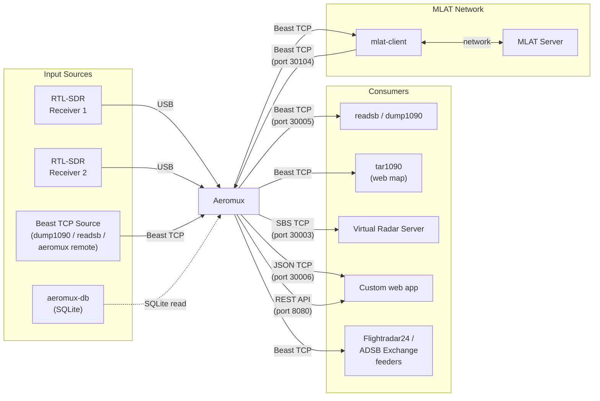

---

## Layers

Aeromux follows a three-layer architecture with a strict dependency rule: each layer may only depend on the layers below it, never above.

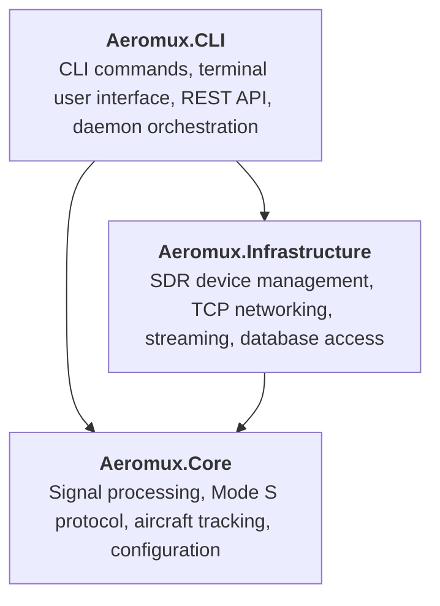

**Aeromux.Core** contains all domain logic and has no dependency on Infrastructure or CLI. This includes I/Q demodulation, preamble detection, CRC validation, message parsing, aircraft state tracking, and the configuration models. Everything in Core is pure computation with no I/O.

**Aeromux.Infrastructure** provides the I/O boundary. It manages RTL-SDR devices through [RtlSdrManager](https://github.com/nandortoth/rtlsdr-manager), connects to external Beast TCP sources, operates TCP servers for Beast, SBS, and JSON broadcast, handles multi-source frame aggregation, accepts MLAT input, and provides SQLite-based aircraft database lookups. Infrastructure depends on Core.

**Aeromux.CLI** is the executable entry point. It contains the CLI command definitions (daemon, live, database, device, version), the terminal user interface built on Spectre.Console, the REST API built on ASP.NET Core Minimal API, and the daemon orchestrator that wires everything together. CLI depends on both Core and Infrastructure.

When contributing, place your code in the appropriate layer: protocol parsing and domain models go in Core, device I/O and networking go in Infrastructure, and commands and user interaction go in CLI.

---

## End-to-End Data Flow

The following diagram shows the complete path that data takes from all input sources through to the network output. Each box represents a named processing stage, and the arrows show the data types that flow between them.

An important architectural detail: the six signal processing stages (from `IQDemodulator` through `MessageParser`) are **not** independent components connected by channels. They run as **synchronous method calls on a single thread** inside `DeviceWorker.OnSamplesAvailable()`. This tight, sequential pipeline minimizes latency and avoids the overhead of cross-thread handoff in the hot path. The first true async boundary is the `FrameAggregator` channel, where processed frames cross from the RtlSdrManager worker thread to the .NET thread pool.

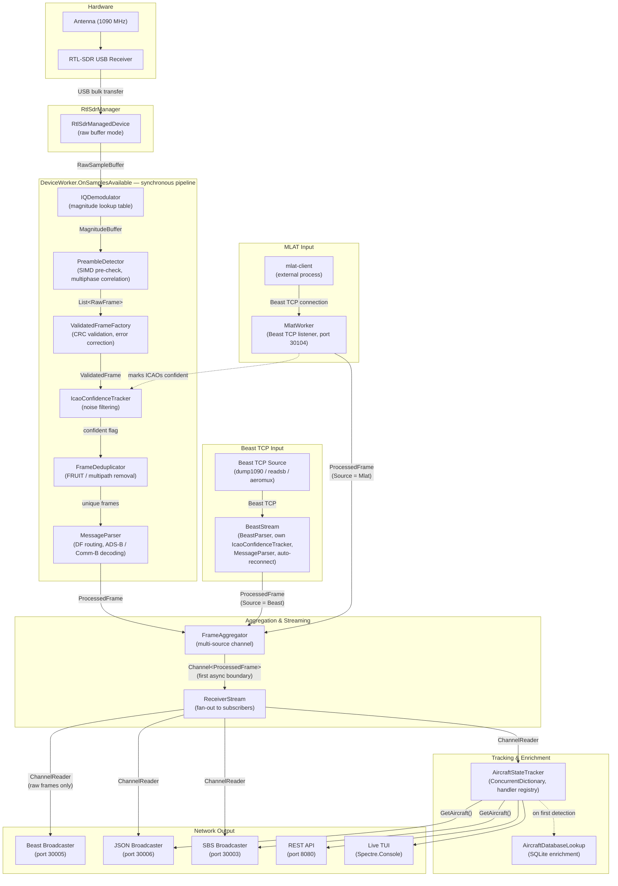

The rest of this document walks through each stage in detail.

---

## Data Types

Data transforms through a series of types as it moves through the pipeline. Understanding these types is essential for working with any stage of the system.

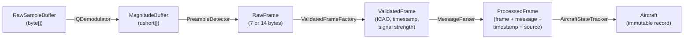

| Type | Stage | Contents | Lifetime |
|------|-------|----------|----------|
| `RawSampleBuffer` | RtlSdrManager callback | Pooled `byte[]` of interleaved I/Q pairs; must be returned to `ArrayPool` via `Return()` | Single callback — returned to pool after processing |
| `MagnitudeBuffer` | IQ demodulation | Pre-allocated `ushort[]` with 326-sample prefix overlap from the previous buffer | Reused from a pool of 12 rotating buffers |
| `RawFrame` | Preamble detection | 7 bytes (short, DF 0/4/5/11) or 14 bytes (long, DF 17/18/20/21) of extracted Mode S data | Transient — validated immediately |
| `ValidatedFrame` | CRC validation | ICAO address (`uint` + hex `string`), raw frame bytes, reception timestamp, signal strength | Carried inside `ProcessedFrame` to output |
| `ProcessedFrame` | Parse + packaging | Combines `ValidatedFrame` + `ModeSMessage?` + `DateTime` timestamp + `FrameSource` enum (Sdr/Beast/Mlat) | Flows through channels to all subscribers |
| `Aircraft` | State tracking | Immutable record with grouped property sets: identification, position, velocity, status, history, and optional sections (autopilot, ACAS, meteorology, capabilities, data quality) | Lives in `ConcurrentDictionary` until expiration (default 60s) |

The `ProcessedFrame` is the bridge between the signal processing and output sides of the system. It carries both representations — raw frame bytes for binary protocols and decoded message for state-based protocols — so that **each frame is parsed exactly once** regardless of how many output formats are active.

---

## RtlSdrManager Integration

Aeromux does not interact with the RTL-SDR hardware directly. All device management — discovery, configuration, sample acquisition, and shutdown — is handled by [RtlSdrManager](https://github.com/nandortoth/rtlsdr-manager), a .NET library that wraps the native `librtlsdr` C library through P/Invoke.

### Device Discovery and Configuration

RtlSdrManager provides a singleton `RtlSdrDeviceManager` that queries the USB bus for connected RTL-SDR receivers. Each detected device is represented by a `DeviceInfo` record containing its index, serial number, manufacturer, and product name. Aeromux's `DeviceWorker` opens a device by index and friendly name, which returns an `RtlSdrManagedDevice` instance that exposes the full configuration surface.

For Mode S reception, Aeromux configures every device with the same radio parameters:

| Parameter | Value | Purpose |
|-----------|-------|---------|
| Center frequency | 1090 MHz | Mode S/ADS-B transponder frequency |
| Sample rate | 2.4 MSPS | Required by the preamble detection algorithm |
| USB buffer size | 512 KB | Depth of the USB bulk transfer buffer |
| Samples per callback | 131,072 (8 × 16,384) | Batch size delivered per `SamplesAvailable` event |

Gain mode (AGC or manual) and frequency correction (PPM) are configurable per device in the YAML configuration file.

### Raw Buffer Mode

Starting with RtlSdrManager 0.6.0, Aeromux uses **raw buffer mode** for zero-copy sample delivery. In this mode, the library rents byte arrays from `ArrayPool<byte>.Shared` inside the native USB callback, copies the raw samples with a single `memcpy`, and wraps the result in a `RawSampleBuffer`. This avoids allocating `IQData` struct objects per sample — at 2.4 million samples per second, the allocation savings are substantial.

The flow from hardware to managed code is:

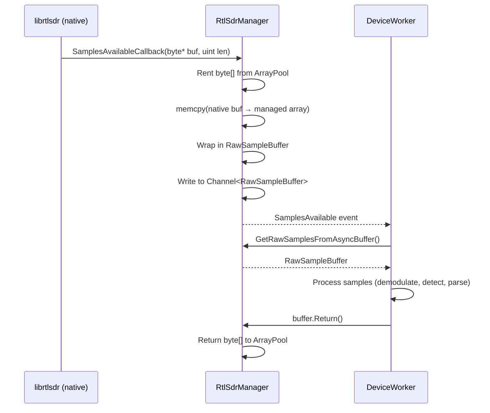

The `SamplesAvailable` event fires on the library's worker thread. `DeviceWorker` calls `GetRawSamplesFromAsyncBuffer()` to retrieve the `RawSampleBuffer`, processes the raw bytes through the signal processing pipeline, and then calls `buffer.Return()` to release the array back to the pool. The `Return()` call is in a `finally` block, ensuring the buffer is always released even if processing throws an exception. This pattern keeps steady-state allocations near zero.

---

## Signal Processing Pipeline

The signal processing pipeline converts raw radio samples into candidate Mode S frames. It runs synchronously inside `DeviceWorker.OnSamplesAvailable()` on the RtlSdrManager worker thread. There are no channels or async boundaries between stages — each stage passes its output directly to the next via method calls. This design keeps the hot path tight and avoids per-frame thread pool scheduling overhead.

The pipeline consists of two stages: magnitude conversion and preamble detection.

### IQ Demodulation

`IQDemodulator` converts interleaved I/Q byte pairs into magnitude values. Radio signals are received as pairs of in-phase (I) and quadrature (Q) components, each represented as an unsigned byte (0–255). The magnitude — the signal's instantaneous power — is computed as $\sqrt{I^2 + Q^2}$ after centering each component around zero.

Rather than computing this for every sample at runtime, `IQDemodulator` uses a pre-computed $256 \times 256$ **lookup table** (128 KB). Each entry maps a byte pair directly to a 16-bit magnitude value, eliminating approximately 4.8 million square-root operations per second at 2.4 MSPS. The conversion reduces to a single array lookup per sample with no floating-point arithmetic.

#### Rolling Buffers and Prefix Overlap

The demodulator maintains a pool of 12 **rolling magnitude buffers**, cycling through them round-robin. Each buffer has a **326-sample prefix region** that is copied from the tail of the previous buffer. The prefix size is derived from the Mode S frame geometry:

$$
(8\,\mu s\ \text{preamble} + 112\,\text{bit max message} + 16\,\text{bit safety margin}) \times 2.4\,\text{samples}/\mu s = 326\,\text{samples}
$$

This overlap ensures that preambles straddling a buffer boundary are not missed — the preamble detector can scan seamlessly across the join point without special boundary logic. The 12-buffer pool provides enough depth that no buffer is reused while a previous one might still be referenced.

### Preamble Detection

`PreambleDetector` scans the magnitude buffer for Mode S preamble patterns and extracts complete frames. A Mode S preamble consists of four pulses at precisely defined positions (0, 1.0, 3.5, and 4.5 microseconds), and the detector must find these patterns within the noisy magnitude data.

Detection proceeds in two phases: a fast SIMD pre-check that rejects the vast majority of non-preamble positions, followed by a detailed multiphase correlation that extracts and validates candidate frames.

#### SIMD Pre-Check

The SIMD pre-check uses `Vector128<ushort>` to test 8 consecutive sample positions in parallel against three simple amplitude conditions. Positions that fail any condition are immediately discarded. This rejects approximately 90% of candidates with roughly 11 vector operations instead of the 80+ scalar comparisons that would otherwise be needed, significantly reducing the work passed to the more expensive correlation stage.

#### Multiphase Correlation

At 2.4 MSPS, the sample clock does not align perfectly with Mode S bit boundaries. The detector compensates by testing 5 possible phase alignments (phases 4 through 8) for each candidate position. For each phase, it estimates a noise floor from local valley samples and applies a configurable threshold to separate signal from noise. The threshold is adaptive — it scales with the local noise level rather than using a fixed cutoff.

Each phase has a hand-tuned set of weighted correlation coefficients for extracting individual bits. These coefficients account for the sub-sample timing offset of that particular phase alignment, producing cleaner bit decisions than simple threshold slicing.

#### Sample-Offset Timestamps

Each extracted frame receives a timestamp computed from the buffer's reception time plus the frame's sample offset within the buffer. The formula is:

$$
T_{\text{frame}} = T_{\text{buffer}} + (P_{\text{sample}} - L_{\text{prefix}}) \times T_{\text{tick}}
$$

where $T_{\text{tick}} = \frac{10{,}000{,}000}{2{,}400{,}000} \approx 4.1667$ (.NET ticks per sample at 2.4 MSPS). This approach provides deterministic sub-microsecond timing precision without calling `Stopwatch.Elapsed` per frame, which would introduce GC safepoint overhead. The maximum rounding error is 50 nanoseconds — well within the requirements for MLAT multilateration.

---

## Frame Validation and Filtering

Raw frames extracted by the preamble detector pass through three filtering stages before they reach the message parser. Each stage eliminates a different class of invalid or redundant data, progressively reducing the workload for downstream processing.

### CRC Validation

`ValidatedFrameFactory` checks each frame's 24-bit CRC parity field. Mode S uses a standardized CRC polynomial, and the factory can detect and correct single-bit errors. Frames with valid or correctable CRC are promoted to `ValidatedFrame` records containing the extracted ICAO address (both as a `uint` for fast lookups and as a hex string for display), the reception timestamp, and the signal strength.

The ICAO address is extracted differently depending on the downlink format:

- **PI mode** (DF 11, 17, 18) — The ICAO address is transmitted directly in the frame data and can be validated against the CRC.
- **AP mode** (DF 0, 4, 5, 16, 20, 21) — The ICAO address is XORed into the CRC field and must be recovered by reversing the CRC computation. AP mode addresses are inherently noisier because any CRC error produces a plausible but incorrect ICAO.

### Confidence Tracking

`IcaoConfidenceTracker` filters noise by requiring an ICAO address to be seen a minimum number of times before its frames are accepted for parsing. This prevents random noise bursts from generating phantom aircraft. The tracker maintains a dictionary of ICAO addresses (keyed by `uint` for fast integer lookups) with detection counters, and supports three configurable confidence thresholds:

| Level | Required Detections |
|-------|---------------------|
| Low | 5 |
| Medium | 10 |
| High | 15 |

Only frames from ICAOs that have reached the configured threshold are marked as confident and forwarded to parsing. Key behaviors:

- **AP mode gating** — AP mode frames (DF 0, 4, 5, 16, 20, 21), which are more susceptible to noise, are only accepted if the ICAO is already marked as confident from prior PI mode frames or MLAT confirmations.
- **Cross-source sharing** — The confidence tracker is shared across all SDR devices and the MLAT input. An ICAO confirmed by MLAT immediately becomes trusted for all SDR workers, and frames from one device contribute to the confidence of ICAOs seen by another.
- **Lazy expiration** — ICAOs that have not been seen within a configurable timeout are cleaned up during normal operation, triggered every 100 frames to avoid unnecessary overhead.

### Deduplication

`FrameDeduplicator` removes duplicate frames caused by FRUIT (False Replies Unsynchronized In Time), multipath reflections, and overlapping interrogator coverage.

- **Detection** — Computes a compact key from each frame's content and checks it against a time-windowed dictionary (default 50 ms). Legitimate Mode S retransmissions occur 400–600 ms apart, so the 50 ms window safely eliminates true duplicates without discarding valid retransmissions.
- **Implementation** — O(1) dictionary lookups with LRU eviction to bound memory usage.
- **Scope** — In multi-device setups, deduplication runs independently per device (before aggregation), filtering approximately 30% of frames and saving the corresponding CPU cost of parsing each one.

---

## Message Decoding

`MessageParser` decodes validated frames into strongly-typed message objects. It is implemented as a partial class split across seven files, one per protocol family:

| File | Downlink Formats | Content |
|------|------------------|---------|
| `MessageParser.cs` | — | Core routing and statistics |
| `MessageParser.ExtendedSquitter.cs` | DF 17, 18, 19 | ADS-B messages (identification, position, velocity, status) |
| `MessageParser.Surveillance.cs` | DF 4, 5 | Altitude and identity surveillance replies |
| `MessageParser.AllCall.cs` | DF 11 | All-call reply (aircraft capability) |
| `MessageParser.Acas.cs` | DF 0, 16 | ACAS/TCAS air-to-air coordination |
| `MessageParser.CommB.cs` | DF 20, 21, 24 | Comm-B data registers (BDS) |
| `MessageParser.Helpers.cs` | — | Bit extraction and utility methods |

The parser routes each frame by its downlink format (DF) field, then further dispatches ADS-B messages by type code (TC) and Comm-B messages by BDS register. The output is an abstract `ModeSMessage` with over 20 concrete subclasses, each representing a specific message type such as `AirbornePositionMessage`, `AircraftIdentificationMessage`, or `AirborneVelocityMessage`.

### Parse-Once Architecture

Each frame is parsed exactly once, at the point where it enters the system. The result is packaged into a `ProcessedFrame` record that carries both the raw `ValidatedFrame` and the decoded `ModeSMessage` (which may be null for frames that could not be parsed). Downstream consumers choose which representation they need — see the [Data Types](#data-types) section for the full transformation chain.

This eliminates redundant parsing across multiple output formats and ensures consistency — every consumer sees the same decoded result for a given frame.

---

## Multi-Source Aggregation and Streaming

Aeromux supports multiple input sources operating simultaneously: RTL-SDR devices (each covering the same frequency but potentially receiving different aircraft due to antenna placement), Beast TCP sources (remote dump1090, readsb, or aeromux instances), and optional MLAT input. The aggregation and streaming layers combine frames from all sources and distribute them to multiple consumers.

### Frame Aggregation

`FrameAggregator` merges frames from all sources — `DeviceWorker` instances, `BeastStream` instances, and the optional `MlatWorker` — into a single stream. Each source calls `AddData(ProcessedFrame)` from its own thread, and the aggregator writes each frame into an unbounded `Channel<ProcessedFrame>`. This is the first async boundary in the system — the point where data crosses from the source threads to the .NET thread pool. The channel handles all synchronization internally.

Frame ordering across sources is non-deterministic (whichever source's callback fires first gets written first), but this is acceptable because downstream consumers process frames independently by ICAO address and timestamp.

### Receiver Stream

`ReceiverStream` is the central hub that manages source lifecycles and distributes frames to subscribers. It performs three roles:

1. **Source management** — Creates and configures `DeviceWorker` instances for each SDR device, `BeastStream` instances for each Beast TCP source, and an optional `MlatWorker`. SDR workers share a single `IcaoConfidenceTracker` (MLAT marks ICAOs as confident for SDR workers). Each `BeastStream` has its own independent `IcaoConfidenceTracker`.

2. **Fan-out broadcasting** — Runs a background task (`BroadcastToSubscribersAsync`) that reads from the `FrameAggregator` and writes each frame to every subscriber's dedicated channel. The subscriber list is managed with a copy-on-write snapshot pattern: a volatile array reference is read lock-free during broadcast and only rebuilt when a subscriber is added or removed.

3. **Subscription management** — Each call to `Subscribe()` returns a new `ChannelReader<ProcessedFrame>` backed by its own unbounded channel. Subscribers are fully independent — a slow subscriber does not block others.

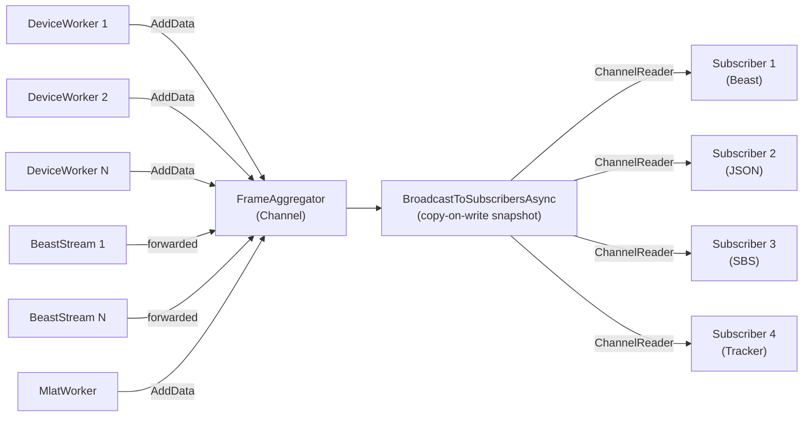

---

## Aircraft State Tracking

`AircraftStateTracker` is the stateful core that accumulates decoded messages into a coherent per-aircraft view. It maintains a `ConcurrentDictionary<string, Aircraft>` keyed by ICAO address, where each `Aircraft` is an immutable record containing grouped property sets for identification, position, velocity, status, history, and several optional sections (autopilot, ACAS, meteorology, capabilities, data quality).

### Consumer Task

The tracker subscribes to the frame stream by calling `StartConsuming(ChannelReader<ProcessedFrame>)`, which launches a background task that reads frames from the channel in a continuous loop. For each frame, it either creates a new `Aircraft` (first detection) or updates the existing record using `ConcurrentDictionary.AddOrUpdate()`.

### Handler Registry

Message-specific updates are delegated to a registry of `ITrackingHandler` implementations. The `TrackingHandlerRegistry` maps each message type to the appropriate handler:

| Handler | Message Types | Updates |
|---------|---------------|---------|
| `AirbornePositionHandler` | TC 9–18, 20–22 | CPR position decoding, altitude |
| `AirborneVelocityHandler` | TC 19 | Ground/true speed, heading, vertical rate |
| `AircraftIdentificationHandler` | TC 1–4 | Callsign, wake turbulence category |
| `AircraftStatusHandler` | TC 28 | Emergency state, squawk, TCAS RA |
| `OperationalStatusHandler` | TC 31 | NIC, NACp, SIL, ADS-B version |
| `TargetStateAndStatusHandler` | TC 29 | Selected altitude/heading, autopilot modes |
| `SurveillanceAltitudeHandler` | DF 4, 20 | Barometric altitude from surveillance replies |
| `SurveillanceIdentityHandler` | DF 5, 21 | Squawk from identity replies |
| `AllCallReplyHandler` | DF 11 | Aircraft capability flags |
| `CommBHandlers` | DF 20, 21 | BDS register data (meteorology, flight dynamics, etc.) |
| `AcasHandlers` | DF 0, 16 | TCAS coordination messages |

Each handler receives the current `Aircraft` record and the decoded `ModeSMessage`, and returns a new `Aircraft` with the updated fields. Because `Aircraft` records are immutable, updates use `with` expressions to create new instances — the `ConcurrentDictionary` handles the atomic swap.

### Automatic Expiration

A background timer fires every 10 seconds and removes aircraft that have not been seen within the configured timeout (default 60 seconds). Expired aircraft are removed via `TryRemove()` and an `OnAircraftExpired` event is raised for each one. This keeps the tracked aircraft list current without manual intervention.

### History Tracking

When enabled in the configuration, the tracker maintains circular buffers for position, altitude, and velocity history. These buffers record periodic snapshots of each aircraft's state, providing a trail of recent values that the REST API's history endpoint and potential future visualization features can serve.

---

## Network Output

Aeromux serves decoded data over TCP in three standard broadcast formats, plus a REST API for on-demand queries. Each broadcaster subscribes independently to the `ReceiverStream` and operates its own TCP server.

### Data Source Patterns

The three broadcast formats differ in what data they need from the system. This distinction is architecturally important because it determines each encoder's dependencies:

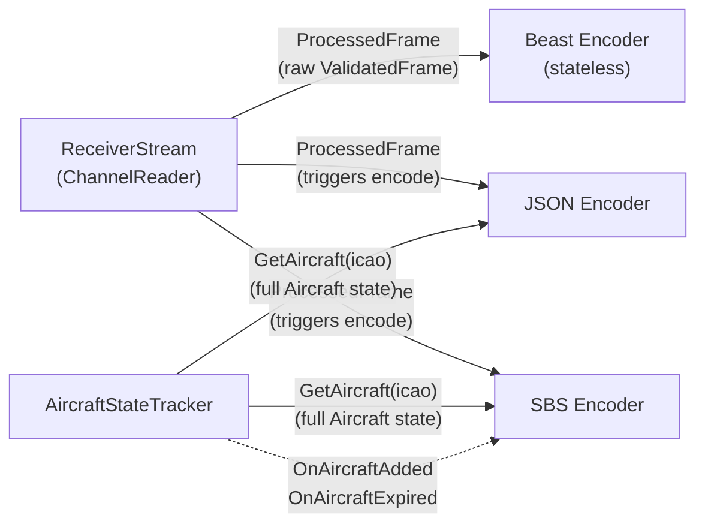

**Beast** reads only the raw `ValidatedFrame` from each `ProcessedFrame`. It has no dependency on the `AircraftStateTracker` and is completely stateless — it encodes raw Mode S bytes, timestamps, and signal strength. This is what makes Beast the most efficient format and why it is enabled by default.

**JSON** and **SBS** both receive `ProcessedFrame` records from the stream, but they also call `GetAircraft()` on the tracker to retrieve the full consolidated aircraft state. A single Mode S frame contains only one piece of information (a position, or a velocity, or an identification), but JSON and SBS output requires the complete aircraft picture. The tracker provides this by accumulating all messages for each ICAO over time. Additionally, the SBS encoder subscribes to `OnAircraftAdded` and `OnAircraftExpired` events to emit AIR messages at the correct lifecycle points.

### TCP Broadcasters

`TcpBroadcaster` is the generic TCP server used by all three broadcast formats. Each broadcaster instance runs two concurrent background tasks:

- **`AcceptClientsAsync`** — Listens for incoming TCP connections and adds them to a thread-safe client list.
- **`BroadcastFramesAsync`** — Reads `ProcessedFrame` records from its subscribed channel, encodes each one using the format-specific encoder, and writes the encoded bytes to all connected clients.

Multiple clients can connect simultaneously to any broadcaster. Disconnected clients are detected during write operations and cleaned up automatically.

The three formats serve different ecosystems:

**Beast** (default port 30005) — Compact binary protocol transmitting raw Mode S frames with timestamps and signal strength.
- Compatible with dump1090, readsb, tar1090, and MLAT networks
- Stateless — preserves all information, allowing receiving applications to perform their own decoding
- Sends an optional receiver UUID (`0xe3` message) for MLAT identification

**SBS** (default port 30003) — CSV text protocol compatible with Virtual Radar Server and BaseStation.
- Each incoming frame may produce up to three SBS messages (AIR, ID, MSG) depending on content
- Subscribes to tracker lifecycle events for AIR message generation

**JSON** (default port 30006) — Newline-delimited JSON stream with full aircraft state per line.
- Rate-limited to one update per aircraft per second to prevent flooding slow consumers
- Structure matches the REST API detail endpoint, so applications can consume both interchangeably

### REST API

The REST API is an ASP.NET Core Minimal API that provides on-demand access to the aircraft tracker's state. Unlike the broadcast formats, which push data continuously, the API requires clients to poll for updates. It exposes five endpoints under `/api/v1/`: aircraft list, aircraft detail, aircraft history, receiver statistics, and a health check. Per-IP rate limiting prevents abuse. See the [API Guide](API.md) for full endpoint documentation.

---

## MLAT Integration

`MlatWorker` provides a parallel ingest path for multilateration position data. When enabled, it listens on a configurable TCP port (default 30104) for connections from `mlat-client`, which transmits Beast-formatted frames containing positions computed by the MLAT network.

- **Multi-client** — Multiple `mlat-client` instances can connect simultaneously, each handled by its own background task.
- **Pipeline bypass** — MLAT frames skip the entire signal processing pipeline (no demodulation or preamble detection) because they arrive pre-processed. The worker parses the Beast binary format, validates the frames, and feeds them into the `FrameAggregator` as `ProcessedFrame` records with `Source = Mlat`. From that point on, they follow the same path as frames from other sources through the tracker and broadcasters.
- **Confidence sharing** — `MlatWorker` shares the same `IcaoConfidenceTracker` as all SDR devices. When an MLAT frame arrives, the worker marks its ICAO address as confident. This means SDR workers will immediately trust AP mode frames (DF 0, 4, 5, 16, 20, 21) from that ICAO — even if the SDR has not yet seen enough PI mode frames to reach the confidence threshold on its own. This cross-source sharing improves tracking coverage, especially for aircraft that transmit few ADS-B messages. Note: Beast TCP input sources (`BeastStream`) do not participate in this shared tracker — each has its own independent `IcaoConfidenceTracker`.

---

## Database Enrichment

When database enrichment is enabled, Aeromux looks up static metadata for each aircraft when it is first detected. `AircraftDatabaseLookupService` maintains a read-only SQLite connection to the [aeromux-db](https://github.com/nandortoth/aeromux-db) database and queries it by ICAO address to retrieve:

- Registration (tail number) and country
- Aircraft type code, ICAO class, model, and manufacturer
- Operator name
- Regulatory flags: PIA (Privacy ICAO Address), LADD (Limiting Aircraft Data Displayed), and military status

The lookup is performed once per aircraft (on first detection) and the result is stored in the `Aircraft` record's `DatabaseRecord` field. This lazy approach avoids repeated queries for the same aircraft while keeping the database connection lightweight.

---

## Concurrency Model

Aeromux processes a continuous stream of radio data in real time, which requires careful coordination across multiple threads and async tasks. The following diagram shows how data crosses thread boundaries through channels, and which background tasks run on the .NET thread pool.

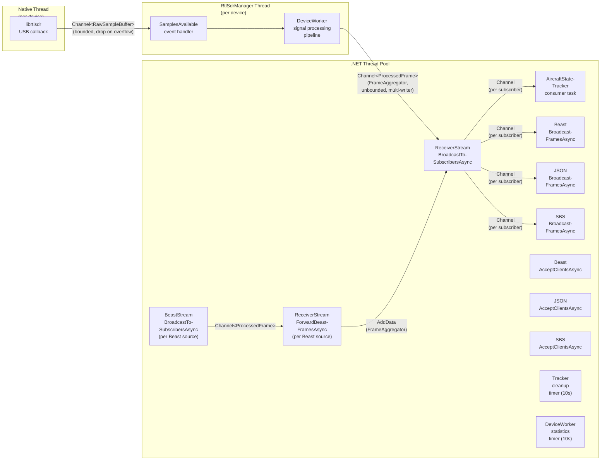

Each column represents a thread boundary. Data crosses between threads exclusively through `Channel<T>` instances:

- **Native → RtlSdrManager** — The librtlsdr USB callback fires on a native thread. RtlSdrManager copies the raw bytes into a pooled buffer and writes it to a bounded channel. The `SamplesAvailable` event handler and the entire signal processing pipeline (demodulation, preamble detection, CRC validation, parsing) run synchronously on the RtlSdrManager worker thread.
- **RtlSdrManager → Thread Pool** — Each `DeviceWorker` writes `ProcessedFrame` records into the `FrameAggregator` channel. This is the first and only async boundary in the SDR data path. Each `BeastStream` also runs its own async task that parses incoming Beast TCP data and forwards frames into the same aggregator. From this point on, all processing runs as async tasks on the .NET thread pool.
- **Broadcast fan-out** — `BroadcastToSubscribersAsync` reads from the aggregator and writes to each subscriber's dedicated channel. Each subscriber (tracker, Beast, JSON, SBS) consumes its channel independently on its own async task.

### Channels

All data flows through `System.Threading.Channels.Channel<T>`, which provides thread-safe, allocation-free handoff between producers and consumers:

| Channel | Type | Bounded | Writers | Readers | Backpressure |
|---------|------|---------|---------|---------|--------------|
| RtlSdrManager internal | `Channel<RawSampleBuffer>` | Yes | 1 (native callback) | 1 (event handler) | Drop on overflow |
| FrameAggregator | `Channel<ProcessedFrame>` | No | N (one per SDR device + Beast forwarding tasks) | 1 (broadcast task) | None (unbounded) |
| Subscriber | `Channel<ProcessedFrame>` | No | 1 (broadcast task) | 1 (subscriber) | None (unbounded) |

### Thread Safety Patterns

- **`ConcurrentDictionary`** — Used by `AircraftStateTracker` for the aircraft state map. Atomic `AddOrUpdate` with immutable `Aircraft` records ensures lock-free reads.
- **Copy-on-write snapshots** — Used by `ReceiverStream` for the subscriber list. The broadcast loop reads a volatile array reference without locking; the array is rebuilt only when subscribers are added or removed.
- **Lock-protected client lists** — Used by `TcpBroadcaster` for connected TCP clients. A snapshot is taken under lock before each broadcast round to avoid holding the lock during slow network writes.

### Cancellation

Shutdown is coordinated through `CancellationToken` propagation. Each component creates an internal `CancellationTokenSource` linked to the external token passed via `StartAsync()`. When cancellation is requested, channels are completed (which causes `ReadAllAsync` loops to exit), background tasks observe the token and terminate, and resources are disposed in a deterministic order.

---

## Startup and Shutdown

The `DaemonOrchestrator` manages the lifecycle of all components in daemon mode, ensuring that services start and stop in the correct order to avoid data loss or resource leaks.

### Startup Sequence

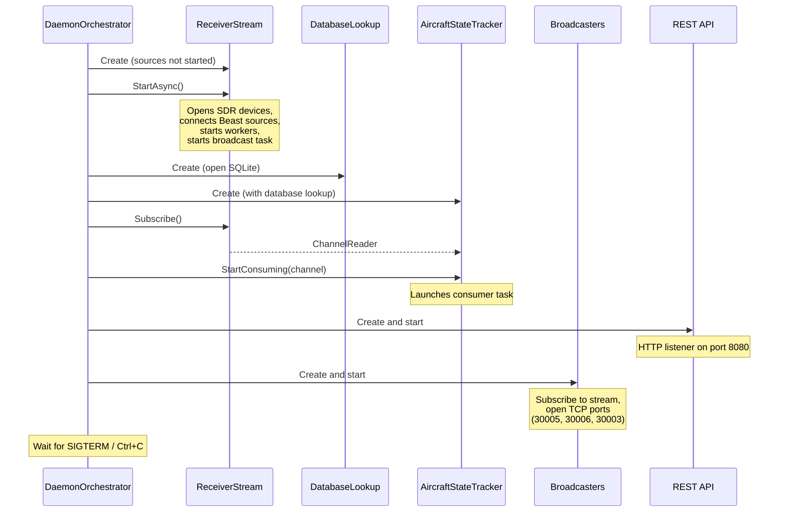

The ordering is critical: `ReceiverStream` must be fully started before any subscriber calls `Subscribe()`, because the internal broadcast task and aggregator channel must exist before subscribers can be registered.

### Shutdown Sequence

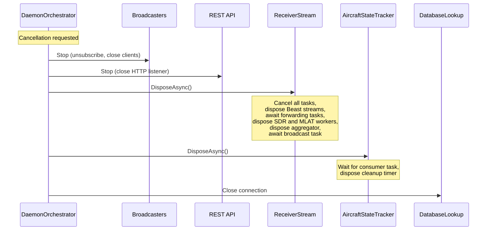

Shutdown proceeds in reverse order: broadcasters unsubscribe first (so they stop trying to read from the stream), then the stream closes (which stops all frame producers before disposing the aggregator, ensuring no concurrent writes to disposed resources), then the tracker waits for its consumer task to finish, and finally the database connection is closed. This ordering ensures that no component attempts to read from a completed channel or write to a disposed resource.

---

## Live TUI Data Flow

The terminal user interface uses a unified input model. The `live` command creates a `ReceiverStream` that can aggregate frames from SDR devices, Beast TCP sources, or both simultaneously. From the tracker's perspective, the data source is transparent — it consumes the same `ChannelReader<ProcessedFrame>` regardless of which input sources are active.

When SDR sources are configured, `ReceiverStream` manages the SDR devices directly and performs all demodulation and decoding locally. When Beast sources are configured, `ReceiverStream` creates internal `BeastStream` instances that connect to the remote servers, parse incoming Beast binary data, and apply confidence filtering through their own `IcaoConfidenceTracker`. All frames are merged through the shared `FrameAggregator`. Beast connections include automatic reconnection with exponential backoff if the remote server becomes unavailable.

The TUI reads the tracker's aircraft state on a display refresh cycle and renders it using Spectre.Console's `Live` display. Keyboard input is handled on a separate thread to keep the display responsive.

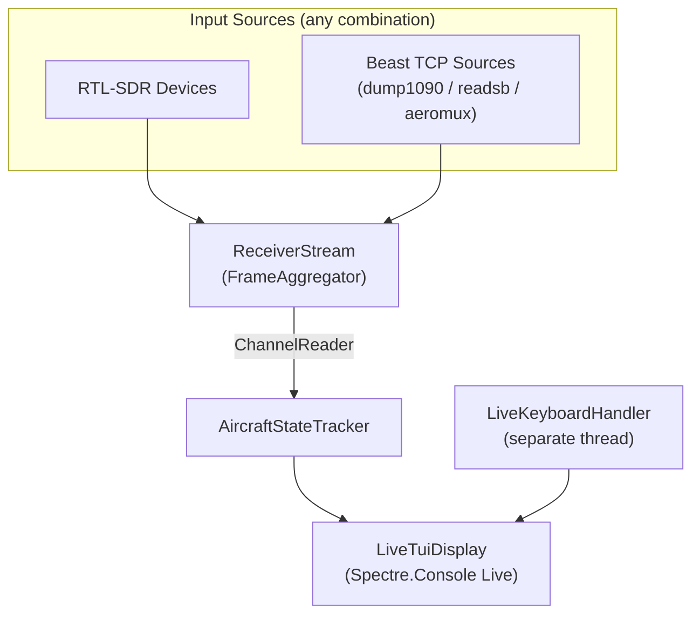

---

## Error Handling and Resilience

Aeromux is designed for continuous, unattended operation. The following table summarizes how each component handles failure scenarios:

| Component | Failure Scenario | Behavior |
|-----------|------------------|----------|
| **DeviceWorker** | SDR device disconnects or USB error | Exception logged; processing stops for that device. No automatic reconnection — requires restart. The `RawSampleBuffer.Return()` call is in a `finally` block, so buffer leaks are prevented even on exceptions. |
| **DeviceWorker** | RtlSdrManager drops samples (USB overflow) | Samples are silently dropped (configured via `DropSamplesOnFullBuffer`). This is preferable to blocking the USB thread, which would cause the kernel to disconnect the device. |
| **TcpBroadcaster** | Client disconnects or write fails | Failed writes are caught per-client. The client is added to a disconnected list, removed after the broadcast round, and disposed. Other clients are unaffected. |
| **TcpBroadcaster** | Slow client | No per-client buffering or backpressure. If a write blocks too long, it eventually throws and the client is disconnected. Other clients proceed independently because writes use a snapshot of the client list. |
| **BeastStream** | Remote Beast source disconnects | Automatic reconnection with persistent retries: 5×5s (startup phase) → 5s, 10s, 20s, 30s, 60s (backoff phase) → 60s (persistent, forever). Startup is non-blocking — the daemon/live command starts normally regardless of Beast source availability. During reconnection, no frames are produced from that source. |
| **ReceiverStream** | Subscriber stops reading | Subscriber channels are unbounded. Frames accumulate in memory until the subscriber resumes or is unsubscribed. There is no automatic drop or backpressure mechanism for subscriber channels. |
| **ReceiverStream** | Broadcast task crashes | All subscriber channels are completed in a `finally` block, signaling EOF to all readers. This ensures subscribers exit cleanly rather than hanging. |
| **MlatWorker** | `mlat-client` disconnects | The per-client reader task exits and the client counter is decremented. The listener remains active for new connections. `mlat-client` is expected to reconnect on its own — MlatWorker is a passive listener. |
| **MlatWorker** | Beast frame parse error | Invalid frames are discarded. The connection remains open and parsing continues with the next frame. |
| **DatabaseLookup** | SQLite query fails | Exception logged. The aircraft is tracked without database enrichment. The connection is protected by a lock to prevent concurrent access. |

### Design Implications

The current resilience model is deliberate: Aeromux favors simplicity and predictability over automatic recovery. SDR device reconnection would require re-negotiating USB state and resetting the signal processing pipeline, which is complex and error-prone. Instead, the system is designed to be restarted by an external supervisor (systemd, Docker, etc.) when a device failure occurs. Beast TCP input sources are the exception — they support automatic reconnection with exponential backoff, since TCP reconnection is straightforward and Beast sources are expected to be intermittently available on a network. Network output clients are expected to handle reconnection on their side, which is the standard pattern in the ADS-B ecosystem.

---

## Performance Considerations

Aeromux is designed to run on resource-constrained hardware, with Raspberry Pi 4 and 5 (ARM64) as primary deployment targets. The following optimizations exist specifically to keep CPU and memory usage within budget on these platforms.

### Hot Path

The performance-critical path is the synchronous pipeline inside `DeviceWorker.OnSamplesAvailable()`. At 2.4 MSPS, this callback fires approximately every 55 milliseconds (131,072 samples per batch) and must complete before the next batch arrives. If processing takes longer than the callback interval, the bounded channel in RtlSdrManager drops samples.

The hot path budget breaks down roughly as:

1. **IQ → Magnitude** — Single array lookup per sample (pre-computed 128 KB table). No floating-point math, no allocations.
2. **Preamble pre-check** — SIMD `Vector128<ushort>` rejects ~90% of candidates in 8-position batches before the expensive correlation runs.
3. **Multiphase correlation** — Only runs on candidates that pass the pre-check. Hand-tuned integer arithmetic, no divisions.
4. **CRC validation** — Bitwise XOR operations on 7 or 14 bytes. Negligible cost.
5. **Confidence + deduplication** — Dictionary lookups keyed by `uint` (ICAO). O(1) with minimal hashing overhead. Deduplication filters ~30% of frames, saving the parsing cost.
6. **Message parsing** — Most expensive per-frame operation, but runs only on unique, confident frames. Bit extraction and enum lookups.

### Memory

- **Magnitude lookup table** — 128 KB, allocated once at startup, shared across devices.
- **Rolling buffers** — 12 buffers × ~524 KB each ≈ 6 MB per device. Pre-allocated, never resized.
- **RawSampleBuffer pooling** — `ArrayPool<byte>.Shared` recycles USB transfer buffers. Steady-state allocations are near zero.
- **Aircraft state** — Immutable records with `with`-expression updates. Short-lived garbage from replaced records, but the working set is bounded by the number of tracked aircraft (typically 30–100).
- **Subscriber channels** — Unbounded. Under normal operation, each channel has at most a few frames queued. A stalled subscriber is the only scenario where memory grows.

### What to Watch When Contributing

If you are modifying the signal processing pipeline, be aware that:

- **Allocations in the callback** are expensive. The callback runs on a high-priority thread, and GC pauses directly impact sample processing latency. Prefer pre-allocated buffers and `Span<T>`.
- **Per-sample operations** multiply by 2.4 million per second. Even a single branch or method call per sample is measurable. The lookup table and SIMD pre-check exist specifically to avoid this.
- **Dictionary key types matter.** The confidence tracker and deduplicator use `uint` keys (ICAO addresses) instead of strings or byte arrays to avoid hashing overhead and allocations.

---

## Key Design Principles

The following principles guide architectural decisions throughout the codebase:

**Zero-copy where possible.** RtlSdrManager's raw buffer mode delivers samples without per-sample allocations. The `IQDemodulator` converts bytes to magnitudes using direct array indexing with no intermediate `IQData` objects. Pre-allocated rolling buffers avoid repeated allocations in the hot path.

**SIMD acceleration.** The preamble detector uses `Vector128<ushort>` to test 8 candidate positions per iteration during its pre-check phase, rejecting approximately 90% of candidates before the more expensive correlation phase runs.

**Parse once, use many times.** Each frame is parsed into a `ProcessedFrame` exactly once at the point of entry. All downstream consumers — Beast encoder, JSON encoder, SBS encoder, aircraft tracker, TUI — share the same parsed result, choosing the representation (raw frame or decoded message) appropriate for their format.

**Shared confidence, independent deduplication.** The `IcaoConfidenceTracker` is shared across all SDR devices and MLAT to maximize cross-source confirmation. Beast TCP input sources each have their own independent `IcaoConfidenceTracker` because they receive pre-filtered frames from a remote system. The `FrameDeduplicator` runs independently per SDR device because duplicates are device-local (multipath, FRUIT).

**Immutable aircraft state.** `Aircraft` records are immutable. State updates create new instances via `with` expressions, and the `ConcurrentDictionary` handles atomic swaps. This eliminates an entire class of race conditions in the multi-reader tracking system.

**Ordered lifecycle.** Startup and shutdown follow strict ordering to prevent data loss and resource leaks. Components are started bottom-up (stream before subscribers) and stopped top-down (subscribers before stream).

**Synchronous hot path, async fan-out.** The signal processing pipeline runs synchronously on a single thread to minimize latency. The first async boundary is the `FrameAggregator` channel, after all CPU-intensive work is done. From there, the .NET thread pool handles fan-out to multiple subscribers.

---

## Architecture Decisions

Several architectural choices in Aeromux are not obvious from the code alone. This section records the key decisions and the reasoning behind them, so that contributors understand the trade-offs rather than revisiting settled questions.

### Why 2.4 MSPS sample rate?

Mode S bit timing is 1 microsecond per bit (1 Mbps). A sample rate of exactly 2.0 MSPS would provide exactly 2 samples per bit, but the sample boundaries would align with the bit boundaries — making it impossible to distinguish between phase offsets. At 2.4 MSPS, the non-integer relationship between sample clock and bit clock creates 5 distinguishable phase alignments (phases 4–8), which the multiphase correlation exploits to extract cleaner bit decisions. Higher rates (e.g., 3.0 MSPS) would improve resolution further but exceed the USB 2.0 throughput budget of most RTL-SDR devices at sustained operation, and would increase CPU load proportionally. 2.4 MSPS is the established sweet spot used by readsb and dump1090.

### Why a synchronous pipeline instead of per-stage channels?

An earlier design used `Channel<T>` between each processing stage (demodulate → detect → validate → parse), which would allow each stage to run on its own thread. This was abandoned because the inter-stage overhead — channel writes, thread pool scheduling, cache invalidation — exceeded the cost of the stages themselves. The preamble detector operates on the magnitude buffer written by the demodulator, and L1/L2 cache locality is lost if the buffer crosses a thread boundary. On a Raspberry Pi 4, the channel-per-stage design consumed 40% more CPU for the same throughput. The synchronous pipeline keeps the entire hot path on one thread with one warm cache, and the only async boundary is the `FrameAggregator` channel after all CPU-intensive work is complete.

### Why immutable Aircraft records instead of mutable state?

The `AircraftStateTracker` is read by multiple concurrent consumers: the JSON encoder, the SBS encoder, the REST API, and the TUI. A mutable `Aircraft` object would require locking on every read and write, and a reader could observe a partially updated state (e.g., position from one message, velocity from another). Immutable records with `ConcurrentDictionary.AddOrUpdate()` and `with` expressions guarantee that every reader sees a consistent snapshot. The cost is short-lived garbage from replaced records, but the working set is small (typically 30–100 aircraft) and the GC overhead is negligible compared to the locking overhead it replaces.

### Why unbounded subscriber channels?

Subscriber channels (from `ReceiverStream` to each broadcaster and the tracker) are unbounded. Bounded channels with backpressure were considered, but they introduce a risk: if a slow subscriber (e.g., a TCP broadcaster writing to a congested client) exerts backpressure on the broadcast task, it would stall frame delivery to *all* subscribers, including the tracker. This would cause aircraft state to go stale and frames to accumulate in the `FrameAggregator` channel, eventually putting backpressure on the signal processing pipeline itself. Unbounded channels isolate subscribers from each other — a slow consumer grows its own queue without affecting others. The trade-off is a theoretical memory growth risk if a subscriber permanently stalls, but in practice this does not occur because stalled TCP clients are disconnected by write timeouts.

### Why per-device deduplication instead of post-aggregation?

`FrameDeduplicator` runs inside each `DeviceWorker`, before frames reach the `FrameAggregator`. An alternative design would deduplicate after aggregation, which would also catch cross-device duplicates (the same frame received by two antennas). The per-device approach was chosen because it filters approximately 30% of frames *before* they are parsed by `MessageParser`, which is the most expensive per-frame operation. Cross-device duplicates are relatively rare (they require overlapping antenna coverage for the same aircraft) and are effectively deduplicated by the `AircraftStateTracker`, which merges frames by ICAO address regardless of source. The per-device design saves more CPU than post-aggregation deduplication would, at the cost of occasional redundant tracker updates.

---

## Known Limitations

The following limitations are known and accepted in the current design. They are documented here so that contributors understand the boundaries and can make informed decisions about whether to address them.

**No automatic SDR reconnection.** If an RTL-SDR device disconnects (USB error, cable unplugged, kernel driver conflict), processing stops for that device and does not resume. Reconnection would require re-opening the device, re-configuring radio parameters, resetting the demodulator's rolling buffer state, and re-synchronizing the preamble detector's phase tracking. This complexity is not justified when a process supervisor (systemd, Docker) can restart the entire application in under a second. A future improvement could add device-level restart without full process restart.

**Unbounded subscriber channels can grow in memory.** If a subscriber's consumer task stalls (e.g., due to a deadlock or an unhandled exception), its channel queue grows indefinitely because there is no capacity limit or drop policy. In normal operation this does not occur — TCP broadcasters disconnect slow clients, and the tracker processes frames faster than they arrive. A bounded channel with a drop-oldest policy could be added as a safety net, but has not been needed in practice.

**No cross-source frame deduplication.** When multiple input sources (SDR devices with overlapping antenna coverage, or an SDR device and a Beast source receiving from the same area) receive the same Mode S frame, all copies reach the tracker and result in redundant state updates. This is harmless — the tracker's `AddOrUpdate` produces the same result regardless of how many times the same data arrives — but it wastes a small amount of CPU on duplicate parsing and tracking handler invocations.

**Beast receiver ID sent only once.** The Beast broadcaster sends the receiver UUID (`0xe3` message) when the first data frame is broadcast. Clients that connect after this point do not receive the receiver ID, which can affect MLAT identification. A periodic re-broadcast or per-client initial send would address this, but the current behavior matches the convention established by dump1090 and readsb.

**Single-threaded signal processing per device.** The entire signal processing pipeline (demodulate → detect → validate → parse) runs synchronously on the RtlSdrManager worker thread. If processing cannot keep up with the 2.4 MSPS sample rate (approximately 55 ms per batch), samples are dropped. On Raspberry Pi 4 this leaves limited headroom; on Raspberry Pi 5 and desktop hardware it is not a concern. Splitting the pipeline across threads was tested and rejected due to cache locality loss (see [Architecture Decisions](#architecture-decisions)), but the trade-off may change with future hardware or workload changes.

---

## Key Source Files

This section maps each architectural component to its source files and explains what each file is responsible for, so you know where to look when contributing to a specific area of the system.

### Signal Processing Pipeline

The hot path lives in these files. Changes here directly affect throughput and must be tested on target hardware (Raspberry Pi).

```
src/
├── Aeromux.Core/
│   ├── ModeS/
│   │   ├── FrameDeduplicator.cs
│   │   ├── IcaoConfidenceTracker.cs
│   │   ├── MessageParser*.cs
│   │   ├── PreambleDetector.cs
│   │   ├── ProcessedFrame.cs
│   │   └── ValidatedFrameFactory.cs
│   └── SignalProcessing/
│       └── IQDemodulator.cs
└── Aeromux.Infrastructure/
    └── Sdr/
        └── DeviceWorker.cs
```

- **DeviceWorker.cs** — Orchestrates a single RTL-SDR device: opens and configures the device via RtlSdrManager, handles the `SamplesAvailable` callback, and runs the entire synchronous pipeline (demodulate → detect → validate → parse) within that callback. Also runs a background statistics loop. This is the file to start with when tracing the data flow.
- **IQDemodulator.cs** — Converts raw I/Q byte pairs to magnitude values using the pre-computed 256×256 lookup table. Manages the pool of 12 rolling magnitude buffers and the 326-sample prefix overlap between them.
- **PreambleDetector.cs** — Scans magnitude buffers for Mode S preamble patterns. Contains the SIMD pre-check (`Vector128<ushort>`), the multiphase correlation with hand-tuned coefficients, and the sample-offset timestamp calculation. The most algorithmically complex file in the codebase.
- **ValidatedFrameFactory.cs** — Checks 24-bit CRC parity, performs single-bit error correction, and extracts the ICAO address (PI mode and AP mode). Promotes raw frames to `ValidatedFrame` records.
- **IcaoConfidenceTracker.cs** — Tracks per-ICAO detection counts and enforces the confidence threshold. Shared across all devices and MLAT — if you need to understand the cross-source trust model, start here.
- **FrameDeduplicator.cs** — Removes FRUIT, multipath, and multi-interrogator duplicates using a time-windowed dictionary with LRU eviction. One instance per device.
- **MessageParser\*.cs** — Seven partial class files, one per protocol family. Routes by downlink format (DF), then by type code (TC) or BDS register. If you are adding support for a new message type, identify the correct partial file by DF and add your decoding logic there.
- **ProcessedFrame.cs** — The record type that bridges signal processing and output. Carries both the raw `ValidatedFrame` and the decoded `ModeSMessage`. Small file, but central to understanding the parse-once architecture.

### Aggregation and Streaming

These files handle the async boundary between the signal processing thread and the .NET thread pool, and the fan-out to multiple subscribers.

```
src/
└── Aeromux.Infrastructure/
    ├── Aggregation/
    │   └── FrameAggregator.cs
    └── Streaming/
        ├── BeastStream.cs
        └── ReceiverStream.cs
```

- **FrameAggregator.cs** — Merges `ProcessedFrame` records from multiple device workers into a single `Channel<ProcessedFrame>`. Simple pass-through — no filtering or reordering.
- **ReceiverStream.cs** — The central hub: creates device workers, manages the shared `IcaoConfidenceTracker`, runs the fan-out broadcast task, and provides `Subscribe()`/`Unsubscribe()` for consumers. If you are adding a new output format, you will subscribe to this stream.
- **BeastStream.cs** — Connects to a remote Beast TCP source (dump1090, readsb, another Aeromux instance), parses Beast binary data, applies confidence filtering through its own `IcaoConfidenceTracker`, and produces `ProcessedFrame` records. Used by `ReceiverStream` internally — one instance per configured Beast source. Includes automatic reconnection with exponential backoff.

### Aircraft Tracking

The stateful side of the system. These files accumulate per-aircraft state from individual Mode S messages.

```
src/
└── Aeromux.Core/
    └── Tracking/
        ├── Aircraft.cs
        ├── AircraftStateTracker.cs
        └── Handlers/
```

- **AircraftStateTracker.cs** — Maintains the `ConcurrentDictionary<string, Aircraft>` and runs the consumer task that reads from the frame channel. Routes each message to the appropriate handler, manages automatic expiration, and fires lifecycle events (`OnAircraftAdded`, `OnAircraftUpdated`, `OnAircraftExpired`).
- **Aircraft.cs** — The immutable record that holds all known state for a single aircraft. Organized into grouped property sets (identification, position, velocity, etc.) with optional sections for less common data. If you are adding a new tracked field, define it here.
- **Handlers/** — Fourteen handler files, one per message category. Each handler implements `ITrackingHandler` and knows how to update an `Aircraft` record from a specific `ModeSMessage` subclass. To support a new message type end-to-end, add a handler here and register it in `TrackingHandlerRegistry`.

### Network Output

These files serve decoded data to external consumers over TCP and HTTP.

```
src/
├── Aeromux.CLI/
│   └── Commands/
│       └── Daemon/
│           └── Api/
│               ├── DaemonApiRoutes.cs
│               └── DaemonApiServer.cs
└── Aeromux.Infrastructure/
    └── Network/
        ├── TcpBroadcaster.cs
        └── Protocols/
            ├── BeastEncoder.cs
            ├── JsonEncoder.cs
            └── SbsEncoder.cs
```

- **TcpBroadcaster.cs** — Generic TCP server used by all three broadcast formats. Manages client connections, runs the accept and broadcast background tasks, and dispatches to the format-specific encoder. If you are adding a new broadcast format, you will instantiate a new `TcpBroadcaster` with your encoder.
- **BeastEncoder.cs** — Stateless encoder that converts `ValidatedFrame` to Beast binary format. No dependency on the tracker — works purely from raw frame data.
- **JsonEncoder.cs** — Encodes full aircraft state as newline-delimited JSON. Depends on `IAircraftStateTracker` to look up consolidated state via `GetAircraft()`. Implements per-aircraft rate limiting (1 update/second).
- **SbsEncoder.cs** — Encodes aircraft state as BaseStation CSV. Depends on `IAircraftStateTracker` for state lookups and subscribes to `OnAircraftAdded`/`OnAircraftExpired` events for AIR message lifecycle.
- **DaemonApiServer.cs** — ASP.NET Core Minimal API host. Configures Kestrel, rate limiting, and JSON serialization.
- **DaemonApiRoutes.cs** — Maps HTTP endpoints (`/api/v1/aircraft`, `/api/v1/stats`, etc.) to handler methods that query the tracker. If you are adding a new API endpoint, add it here.

### MLAT and Database

External data sources that enrich the core tracking pipeline.

```
src/
└── Aeromux.Infrastructure/
    ├── Database/
    │   └── AircraftDatabaseLookupService.cs
    └── Mlat/
        └── MlatWorker.cs
```

- **MlatWorker.cs** — TCP listener that accepts Beast-formatted connections from `mlat-client`. Parses incoming frames, marks ICAOs as confident in the shared tracker, and feeds `ProcessedFrame` records into the aggregator. Supports multiple concurrent clients.
- **AircraftDatabaseLookupService.cs** — Read-only SQLite connection to the aeromux-db database. Queried once per aircraft on first detection to retrieve registration, type, operator, and regulatory flags. Thread-safe via lock.

### Orchestration and CLI

These files wire everything together and manage the application lifecycle.

```
src/
├── Aeromux.CLI/
│   └── Commands/
│       ├── Daemon/
│       │   ├── DaemonBroadcasterCollection.cs
│       │   └── DaemonOrchestrator.cs
│       └── Live/
│           ├── LiveKeyboardHandler.cs
│           └── LiveTuiDisplay.cs
└── Aeromux.Core/
    └── Configuration/
        └── AeromuxConfig.cs
```

- **DaemonOrchestrator.cs** — Controls the startup and shutdown sequence for daemon mode. Creates components in dependency order, manages their lifecycle, and performs ordered disposal. The best file to read for understanding how the system is assembled at runtime.
- **DaemonBroadcasterCollection.cs** — Creates and manages the Beast, JSON, and SBS `TcpBroadcaster` instances. Handles the per-broadcaster startup delay required to work around a macOS ARM64 socket race condition.
- **LiveTuiDisplay.cs** — Main TUI loop for live mode. Reads aircraft state from the tracker on a refresh cycle and renders it using Spectre.Console's `Live` display.
- **LiveKeyboardHandler.cs** — Processes keyboard input for table navigation, sorting, search, unit switching, and detail view. Runs on a dedicated thread to keep the display responsive.
- **AeromuxConfig.cs** — Root configuration model deserialized from the YAML file. Contains nested models for SDR sources, Beast sources, network, tracking, receiver, MLAT, database, and logging. If you are adding a new configurable option, define it in the appropriate nested model.

---

## Glossary

This document uses terminology from aviation surveillance, radio engineering, and Mode S protocol specifications. The following definitions cover the terms used throughout this document.

| Term | Definition |
|------|-----------|
| **ADS-B** | Automatic Dependent Surveillance–Broadcast. A surveillance technology where aircraft broadcast their GPS-derived position, altitude, speed, and identification. Transmitted via Mode S Extended Squitter (DF 17/18) on 1090 MHz. |
| **BDS** | Comm-B Data Selector. A register identifier (e.g., BDS 4,4, BDS 6,0) that specifies the type of data carried in a Comm-B reply (DF 20/21). Different BDS registers carry meteorological data, flight dynamics, aircraft identification, and other information. |
| **Beast** | A binary protocol originally developed for Mode S Beast hardware receivers. Transmits raw Mode S frames with timestamps and signal strength. The de facto standard for exchanging Mode S data between ADS-B applications. |
| **CPR** | Compact Position Reporting. An encoding scheme used in ADS-B position messages that represents latitude and longitude in 17 bits each. Decoding requires either two messages with different odd/even flags (global decode) or one message plus a known reference position (local decode). |
| **CRC** | Cyclic Redundancy Check. Mode S uses a 24-bit CRC for error detection. Depending on the downlink format, the CRC field either contains a pure checksum (PI mode) or the ICAO address XORed with the checksum (AP mode). |
| **dBFS** | Decibels relative to Full Scale. A unit for measuring signal strength where 0 dBFS is the maximum value the ADC can represent. All real signals are negative dBFS values; stronger signals are closer to 0. |
| **DF** | Downlink Format. A 5-bit field in every Mode S message that identifies the message type. Common DFs: 0 (short air-air), 4 (altitude reply), 5 (identity reply), 11 (all-call reply), 17 (ADS-B), 20/21 (Comm-B). |
| **FRUIT** | False Replies Unsynchronized In Time. Mode S replies triggered by interrogators other than the one the receiver is listening for. These are valid Mode S frames but are duplicates of data intended for a different ground station. |
| **ICAO address** | A globally unique 24-bit identifier assigned to every aircraft. Transmitted in or derivable from every Mode S message. Displayed as a 6-character hexadecimal string (e.g., `3C6593`). |
| **I/Q samples** | In-phase and Quadrature samples. The raw output of the RTL-SDR receiver — pairs of 8-bit values representing the amplitude and phase of the received radio signal. At 2.4 MSPS, the receiver produces 4.8 million bytes per second. |
| **LADD** | Limiting Aircraft Data Displayed. An FAA program that allows aircraft operators to request that their tracking data not be publicly displayed. Aeromux flags LADD aircraft using the aeromux-db database. |
| **MLAT** | Multilateration. A technique for determining an aircraft's position by measuring the time difference of arrival (TDOA) of its Mode S transmissions at multiple ground stations. Requires precise timestamps — see [Sample-Offset Timestamps](#sample-offset-timestamps). |
| **Mode S** | Mode Select. A secondary surveillance radar protocol used by aircraft transponders. Operates on 1090 MHz. Supports selective interrogation (unlike Mode A/C) and carries ADS-B as a subset. |
| **MSPS** | Mega Samples Per Second. The sample rate of the RTL-SDR receiver. Aeromux uses 2.4 MSPS, meaning 2.4 million I/Q sample pairs per second. |
| **PIA** | Privacy ICAO Address. An FAA program that assigns temporary ICAO addresses to aircraft whose operators have requested privacy. PIA addresses rotate periodically and cannot be linked to a specific aircraft registration. |
| **Preamble** | The fixed bit pattern at the start of every Mode S transmission. Consists of four pulses at 0, 1.0, 3.5, and 4.5 microseconds. The preamble detector searches for this pattern in the magnitude data to find the start of each frame. |
| **RTL-SDR** | A class of inexpensive USB radio receivers based on the RTL2832U chipset, originally designed for DVB-T television reception. Repurposed for software-defined radio applications including ADS-B reception. Controlled via the `librtlsdr` native library. |
| **SBS** | Also known as BaseStation format. A CSV text protocol developed by Kinetic Avionics for their BaseStation product, later adopted by Virtual Radar Server. Each line represents a single event (aircraft detected, identification received, position update, etc.). |
| **Squawk** | A 4-digit octal code (0000–7777) set by the pilot or assigned by ATC. Special codes: 7500 (hijack), 7600 (radio failure), 7700 (emergency). Transmitted in Mode S identity replies (DF 5, 21). |
| **Squitter** | An unsolicited Mode S transmission — the aircraft broadcasts without being interrogated. ADS-B uses Extended Squitter (DF 17) for position, velocity, and identification broadcasts. |
| **TC** | Type Code. A 5-bit field within ADS-B Extended Squitter messages (DF 17/18) that identifies the specific message content. TC 1–4: identification, TC 9–18: airborne position, TC 19: velocity, TC 28: status, TC 29: target state, TC 31: operational status. |

---

## Further Reading

This document covers the internal architecture of Aeromux. For other aspects of the project, see:

- **[Broadcast Guide](BROADCAST.md)** — Detailed protocol specifications for Beast, SBS, and JSON output formats, including framing, field definitions, and client usage examples.
- **[REST API Guide](API.md)** — Full endpoint documentation with request/response examples for all five API endpoints.
- **[TUI Guide](TUI.md)** — Keyboard reference, sorting, search, unit switching, and detail view documentation for the terminal user interface.
- **[Contributing Guide](../CONTRIBUTING.md)** — Development setup, coding standards, testing, and the pull request process.
