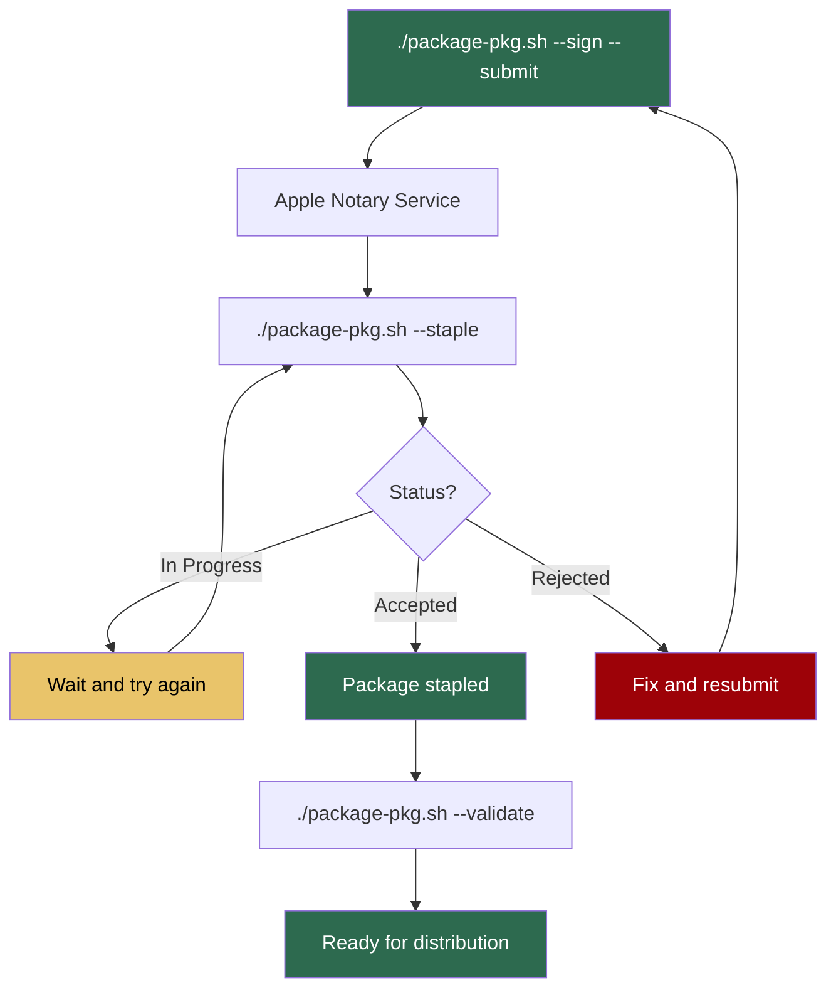

# macOS Packaging

Aeromux is distributed as a `.pkg` installer for macOS, targeting Apple Silicon (ARM64) as the primary platform and Intel (x86-64) as a secondary platform. The package installs aeromux as a command-line tool for interactive use (live TUI mode). No background service is installed — macOS is treated as a client platform.

Packages are built using `pkgbuild` and `productbuild` and can only be built on a macOS host.

## Package Metadata

| Field           | Value                                                 |
|-----------------|-------------------------------------------------------|
| Identifier      | `com.aeromux`                                         |
| Version         | From `src/Directory.Build.props` (e.g., `0.6.0`)      |
| Install Location| `/opt/aeromux`                                        |
| Maintainer      | `Nandor Toth <dev@nandortoth.com>`                    |
| Homepage        | `https://github.com/aeromux/aeromux`                  |
| License         | GPL-3.0-or-later                                      |

## Filesystem Layout

The package uses a split layout: read-only program files are installed under `/opt/aeromux/` (root-owned), while mutable user data goes under `~/Library/` (owned by the current user, created by the `postinstall` script). A symlink in `/usr/local/bin/` provides PATH access. This avoids conflicts with Homebrew (which owns `/usr/local/`).

### Installed Files (root-owned, read-only)

| Path                                          | Type        | Description                          |
|-----------------------------------------------|-------------|--------------------------------------|
| `/opt/aeromux/bin/aeromux`                    | Binary      | Self-contained executable            |
| `/opt/aeromux/bin/aeromux-uninstall`          | Script      | Uninstall script                     |
| `/opt/aeromux/share/man/man1/aeromux.1.gz`    | Man page    | Manual page                          |
| `/opt/aeromux/share/aeromux.example.yaml`     | Template    | Default configuration template       |
| `/usr/local/bin/aeromux`                      | Symlink     | Points to `/opt/aeromux/bin/aeromux` |

### User Directories (created by postinstall)

These directories are created by the `postinstall` script with ownership set to the logged-in user. No `sudo` is needed for day-to-day use.

| Path                                                    | Description                     |
|---------------------------------------------------------|---------------------------------|
| `~/Library/Application Support/aeromux/`                | Configuration and database      |
| `~/Library/Application Support/aeromux/aeromux.yaml`    | User configuration file         |
| `~/Library/Logs/aeromux/`                               | Log files                       |

## Configuration

The package ships a default configuration template at `/opt/aeromux/share/aeromux.example.yaml`, generated at packaging time from the project's `aeromux.example.yaml` with the following transformations applied via `sed`. The replacement patterns include trailing whitespace to preserve the inline comment alignment of the original file.

| Setting                   | Example Config Value         | Package Config Value                              |
|---------------------------|------------------------------|---------------------------------------------------|
| `logging.level`           | `debug`                      | `information`                                     |
| `logging.file.path`       | `"logs/aeromux-.log"`        | `"$HOME/Library/Logs/aeromux/aeromux-.log"`       |
| `database.path`           | `"artifacts/db/"`            | `"$HOME/Library/Application Support/aeromux/"`    |

The config is generated with `$HOME` as a placeholder. The `postinstall` script expands `$HOME` to the logged-in user's actual home directory when placing the configuration file.

There is no separate configuration file to maintain — the packaging script reads the current `aeromux.example.yaml` and applies the substitutions listed above.

### Upgrade Behavior

Unlike `.deb` conffile handling, `.pkg` has no built-in mechanism to preserve user-modified configuration files during upgrades. The `postinstall` script handles this:

- **Fresh install** (no existing `aeromux.yaml`): the config is placed at `~/Library/Application Support/aeromux/aeromux.yaml`.
- **Upgrade** (existing `aeromux.yaml`): the user's configuration is not overwritten. The new default configuration is placed alongside as `aeromux.yaml.default` so the user can compare and merge changes.

The template at `/opt/aeromux/share/aeromux.example.yaml` is always overwritten by the installer, providing a clean reference.

## Prerequisites

The following must be installed before using aeromux on macOS:

| Prerequisite   | Install Command            | Reason                                             |
|----------------|----------------------------|----------------------------------------------------|
| `librtlsdr`    | `brew install librtlsdr`   | RTL-SDR shared library (required by RtlSdrManager) |

The `.pkg` installer cannot declare dependencies. The `postinstall` script checks for the presence of librtlsdr (in both `/opt/homebrew/lib/` and `/usr/local/lib/`) and displays Homebrew install instructions if it is missing.

No other runtime dependencies are required — the binary is a self-contained .NET single-file executable with the runtime bundled.

## Man Page

The package includes a man page at `/opt/aeromux/share/man/man1/aeromux.1.gz` covering commands, global options, file paths, and uninstall instructions. The source is stored as `packaging/pkg/aeromux.1` in troff format (separate from the Linux version in `packaging/deb/aeromux.1`) and compressed with `gzip -9` during packaging.

## Uninstall

The package installs an uninstall script at `/opt/aeromux/bin/aeromux-uninstall`. It requires `sudo` to remove root-owned files in `/opt/aeromux/`.

### Remove (default)

```bash
sudo /opt/aeromux/bin/aeromux-uninstall
```

Removes `/opt/aeromux/` (binary, man page, template config) and the `/usr/local/bin/aeromux` symlink. Forgets the package receipt. Keeps user configuration, database, and log files in `~/Library/`.

### Purge

```bash
sudo /opt/aeromux/bin/aeromux-uninstall --purge
```

Everything from remove, plus removes `~/Library/Application Support/aeromux/` (configuration and database) and `~/Library/Logs/aeromux/` (logs).

## Building Packages

The `.pkg` packaging script builds packages for one or both macOS targets in a single pipeline:

```bash
./packaging/package-pkg.sh --target osx-arm64
./packaging/package-pkg.sh --target osx-arm64 --sign
./packaging/package-pkg.sh --target all --sign --notarize --rebuild
```

The `--target all` option packages both macOS architectures (`arm64` and `x86_64`) sequentially in one run, with per-target progress output. When `--notarize` is used with `--target all`, both packages are submitted for notarization in parallel.

### Options

| Option        | Description                                                             |
|---------------|-------------------------------------------------------------------------|
| `--target`    | Target platform: `osx-arm64`, `osx-x64`, or `all` (required)            |
| `--sign`      | Sign the binary and package with Developer ID certificates              |
| `--notarize`  | Notarize and staple the package synchronously (requires `--sign`)       |
| `--submit`    | Submit for notarization and return immediately (requires `--sign`)      |
| `--staple`    | Check notarization status; staple and validate if accepted              |
| `--validate`  | Verify package signature, notarization, and staple status               |
| `--rebuild`   | Force rebuild of the binary even if it exists and is recent             |
| `--silent`    | Suppress all output (only errors are shown)                             |

`--notarize`, `--submit`, `--staple`, and `--validate` are mutually exclusive — use only one per invocation. `--staple` and `--validate` are standalone operations that do not require building or signing.

### Workflow

1. Parse and validate the target architecture.
2. Check that `pkgbuild` and `productbuild` are available.
3. If `--sign` is specified, verify both Developer ID Application and Developer ID Installer certificates exist in Keychain.
4. If `--notarize` or `--submit` is specified, verify `notarytool` is available and the `aeromux-notary` keychain profile exists.
5. Check the binary at `artifacts/binaries/<runtime-id>/aeromux` — it must exist and be less than 1 hour old, or use `--rebuild` to trigger a fresh build.
6. Read the version from `src/Directory.Build.props`.
7. For each target, create a temporary staging directory with the payload, scripts, and resources.
8. If `--sign` is specified, sign the binary with `codesign` using the Developer ID Application certificate and hardened runtime.
9. Populate staging with the binary, uninstall script, man page, and generated configuration template.
10. Build the component package with `pkgbuild`.
11. Build the product archive with `productbuild` (with `--sign` using Developer ID Installer if specified).
12. If signed, verify the signature with `pkgutil --check-signature`.
13. Output the `.pkg` file to `artifacts/packages/`.
14. If `--notarize` is specified, submit all packages for notarization in parallel, wait for Apple's approval, staple the notarization ticket, and validate.
15. If `--submit` is specified, submit all packages for notarization and return immediately, writing a `.notarization` record file for each package.

For standalone operations (`--staple` and `--validate`), steps 2–13 are skipped. The script reads the version, verifies the `.pkg` exists, and proceeds directly to the requested operation.

### Build Requirements

- **`pkgbuild` and `productbuild`** — for building the `.pkg` installer. Included with Xcode Command Line Tools.
  - Install with: `xcode-select --install`
- **`dotnet`** — .NET SDK for building the binary (already required by `build.sh`).
- **`codesign`** — for binary signing (included with Xcode Command Line Tools). Only needed with `--sign`.
- **`xcrun notarytool`** — for notarization (included with Xcode Command Line Tools). Only needed with `--notarize`, `--submit`, or `--staple`.

## Cross-Compilation

The packaging script supports building packages for both macOS architectures from any macOS host. The `build.sh` script handles cross-compilation of the .NET binary, and the packaging script arranges files and runs `pkgbuild` + `productbuild`.

```bash
# Build the binary first, then package
./build.sh --target osx-arm64
./packaging/package-pkg.sh --target osx-arm64

# Build and package both macOS targets
./build.sh --target macos
./packaging/package-pkg.sh --target all

# Or rebuild as part of packaging (--rebuild calls build.sh automatically)
./packaging/package-pkg.sh --target all --rebuild

# Full pipeline: rebuild, sign, and notarize both targets
./packaging/package-pkg.sh --target all --sign --notarize --rebuild
```

**Note:** `pkgbuild` is only available on macOS. Unlike `.deb` packages (which can be built on any platform with `dpkg-deb`), `.pkg` packages can only be built on a macOS host.

## Install and Upgrade

### Install

```bash
sudo installer -pkg aeromux_0.6.0_macos_arm64.pkg -target /
```

Or double-click the `.pkg` file in Finder. Creates the `/opt/aeromux/` directory, user directories in `~/Library/`, places the configuration file, and displays a post-install message with next steps.

### Upgrade

```bash
sudo installer -pkg aeromux_0.6.0_macos_arm64.pkg -target /
```

Installs new files in `/opt/aeromux/`. The user's configuration at `~/Library/Application Support/aeromux/aeromux.yaml` is preserved — the new default config is placed as `aeromux.yaml.default`.

## Code Signing and Notarization

For packages distributed via GitHub Releases (or any download), both signing and notarization are required. Without notarization, macOS Gatekeeper blocks the installer with a warning when the user opens a downloaded `.pkg` file.

- **`--sign`** signs the binary (with `codesign`) and the `.pkg` (with `productbuild --sign`).
- **`--notarize`** submits the signed `.pkg` to Apple's notary service, waits for approval, staples the notarization ticket, and validates. Requires `--sign`.
- **`--submit`** submits the signed `.pkg` to Apple's notary service and returns immediately. Requires `--sign`.
- **`--staple`** checks the notarization status and, if accepted, staples and validates the ticket.
- **`--validate`** verifies the package signature, notarization acceptance, and staple status.

Unsigned packages work for local testing but cannot be distributed.

### Prerequisites

- **Apple Developer Program membership** ($99/year) — required for Developer ID certificates and notarization.

### Certificate Setup

Two certificates are required, both obtained from the [Apple Developer portal](https://developer.apple.com/account) under Certificates, Identifiers & Profiles:

| Certificate                    | Purpose                              | Tool            |
|--------------------------------|--------------------------------------|-----------------|
| Developer ID Application       | Signs the binary (`codesign`)        | `codesign`      |
| Developer ID Installer         | Signs the `.pkg` (`productbuild`)    | `productbuild`  |

To create each certificate:

1. Go to **Certificates** → click **+**.
2. Select **Developer ID Application** or **Developer ID Installer**.
3. Generate a Certificate Signing Request (CSR) from **Keychain Access** → Certificate Assistant → Request a Certificate from a Certificate Authority.
4. Upload the CSR, select **G2 Sub-CA**, download the `.cer` file.
5. Double-click the `.cer` to install it in your login Keychain. If double-clicking fails, import via command line: `security import ~/Downloads/certificate.cer -k ~/Library/Keychains/login.keychain-db`.
6. Install the [Developer ID - G2 intermediate certificate](https://www.apple.com/certificateauthority/DeveloperIDG2CA.cer) to complete the trust chain.

Verify both certificates are installed:

```bash
security find-identity -v -p basic | grep "Developer ID"
```

### Notarization Setup

Notarization requires an app-specific password and a stored keychain profile.

1. **Generate an app-specific password** at [account.apple.com](https://account.apple.com) → Sign-In and Security → App-Specific Passwords.

2. **Store credentials in Keychain** (one-time setup):

```bash
xcrun notarytool store-credentials "aeromux-notary" \
    --apple-id <your-apple-id-email> \
    --team-id <your-team-id> \
    --password <app-specific-password>
```

3. **Verify** the profile works:

```bash
xcrun notarytool history --keychain-profile "aeromux-notary"
```

The keychain profile name `aeromux-notary` is configured in `package-pkg.sh` as the `NOTARY_PROFILE` constant.

### Synchronous Notarization

The `--notarize` flag performs the entire notarization pipeline in one blocking call — submit, wait for Apple's approval, staple, and validate:

```bash
# Sign and notarize (for distribution)
./packaging/package-pkg.sh --target osx-arm64 --sign --notarize --rebuild

# Sign and notarize both architectures (parallel notarization)
./packaging/package-pkg.sh --target all --sign --notarize --rebuild
```

When using `--target all --notarize`, both packages are submitted to Apple's notary service in parallel, roughly halving the wait time. Notarization typically takes 1-5 minutes but can take longer.

### Async Notarization Workflow

For cases where you don't want to wait for Apple's notarization service, the packaging script supports an async workflow that separates submission from stapling:



**Step 1: Build, sign, and submit**

```bash
./packaging/package-pkg.sh --target osx-arm64 --sign --submit --rebuild
```

Submits the signed package to Apple and returns immediately. The script prints the submission ID and saves it to a `.notarization` record file next to the `.pkg`.

**Step 2: Check status and staple**

```bash
./packaging/package-pkg.sh --target osx-arm64 --staple
```

Checks the notarization status. If Apple has accepted the package, it staples the notarization ticket and validates. If still in progress, it reports the status and prints the command to check again.

**Step 3: Validate**

```bash
./packaging/package-pkg.sh --target osx-arm64 --validate
```

Verifies the package signature, notarization acceptance (via Gatekeeper), and staple status. Confirms the package is ready for distribution.

Each step prints the next command to run on success, guiding through the workflow.

### Notarization Record Files

When `--submit` is used, a `.notarization` sidecar file is written next to each `.pkg` in `artifacts/packages/` (e.g., `aeromux_0.6.0_macos_arm64.pkg.notarization`). This file stores the Apple submission ID so that `--staple` can check the status later.

The record file is automatically deleted after successful stapling or if notarization is rejected. Do not edit these files manually.

### What Happens During Signing

1. The binary is signed with `codesign --sign "Developer ID Application" --options runtime --force`. The `--force` flag is needed because .NET produces ad-hoc signed binaries on macOS. The `--options runtime` flag enables the hardened runtime, which Apple requires for notarization.
2. The binary signature is verified with `codesign --verify`.
3. The `.pkg` is signed with `productbuild --sign "Developer ID Installer"`.
4. The package signature is verified with `pkgutil --check-signature`.

### What Happens During Notarization

**Synchronous (`--notarize`):**

1. The signed `.pkg` is submitted to Apple's notary service via `xcrun notarytool submit --wait`.
2. Apple scans the package and all its contents (including the binary) — this is an automated process with no manual review.
3. Upon approval, the notarization ticket is stapled to the `.pkg` with `xcrun stapler staple`.
4. The staple is validated with `xcrun stapler validate`.

**Async (`--submit` / `--staple`):**

1. `--submit`: The signed `.pkg` is submitted via `xcrun notarytool submit` (without `--wait`). The submission ID is saved to a `.notarization` record file.
2. `--staple`: The submission status is checked via `xcrun notarytool info`. If accepted, the ticket is stapled with `xcrun stapler staple` and validated with `xcrun stapler validate`.

### Verification

The `--validate` flag performs all verification checks in one step:

```bash
./packaging/package-pkg.sh --target osx-arm64 --validate
```

This checks the package signature (`pkgutil --check-signature`), notarization acceptance (`spctl --assess`), and staple status (`xcrun stapler validate`).

The same checks can be run manually:

```bash
# Verify package signature
pkgutil --check-signature artifacts/packages/aeromux_0.6.0_macos_arm64.pkg

# Verify notarization (Gatekeeper assessment)
spctl --assess --type install artifacts/packages/aeromux_0.6.0_macos_arm64.pkg

# Verify stapled ticket
xcrun stapler validate artifacts/packages/aeromux_0.6.0_macos_arm64.pkg

# Inspect package contents
pkgutil --payload-files artifacts/packages/aeromux_0.6.0_macos_arm64.pkg
```

## Static Files

The following files are stored in `packaging/pkg/` and used by the packaging script:

| File                        | Description                                                                    |
|-----------------------------|--------------------------------------------------------------------------------|
| `aeromux.1`                 | Man page source (macOS-specific paths)                                         |
| `aeromux-uninstall`         | Uninstall script (installed to /opt/aeromux/bin)                               |
| `postinstall`               | Post-installation script                                                       |
| `distribution.xml`          | Distribution XML template (with `{{PKG_ARCH}}` and `{{VERSION}}` placeholders) |
| `resources/welcome.html`    | Installer welcome text (with `VERSION_PLACEHOLDER`)                            |
| `resources/conclusion.html` | Post-install summary with next steps                                           |
| `resources/license.html`    | GPLv3 license text for installer UI                                            |

One additional file is generated at packaging time:

| File                   | Source                                                          |
|------------------------|-----------------------------------------------------------------|
| `aeromux.example.yaml` | Generated from `aeromux.example.yaml` with path transformations |
