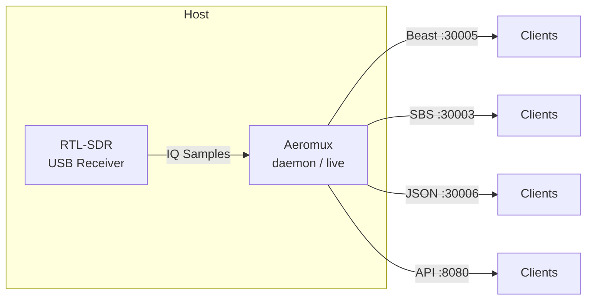
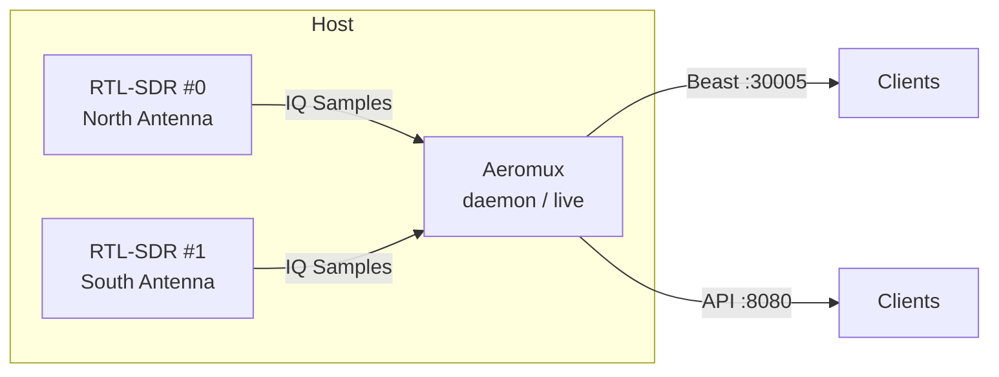
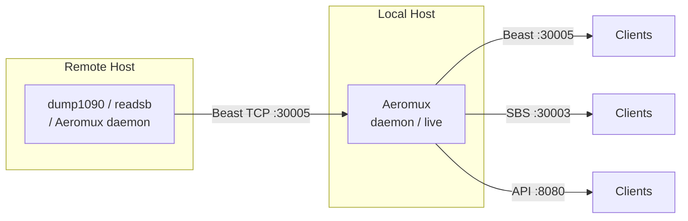
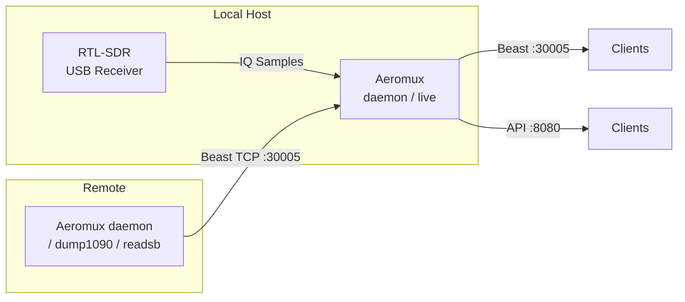
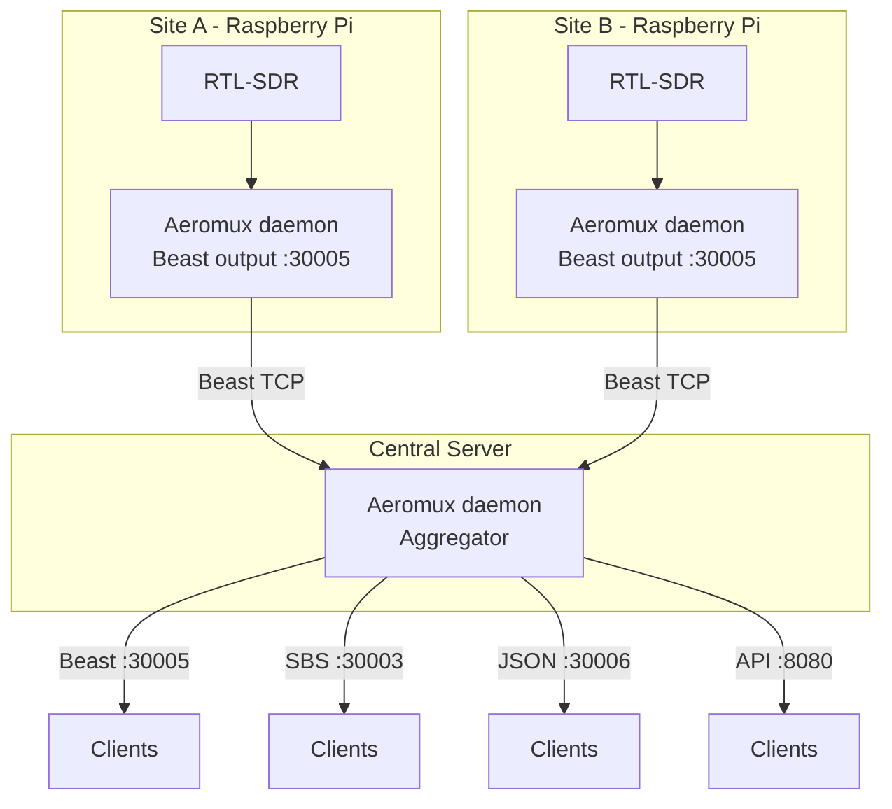
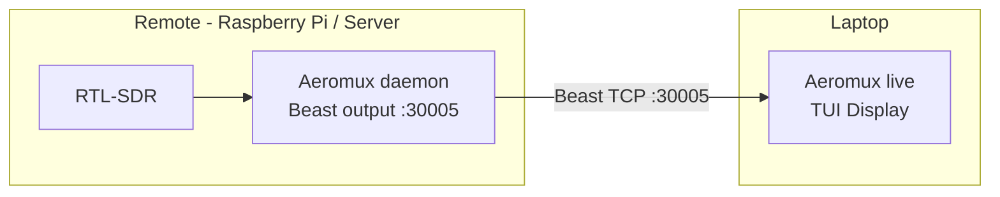
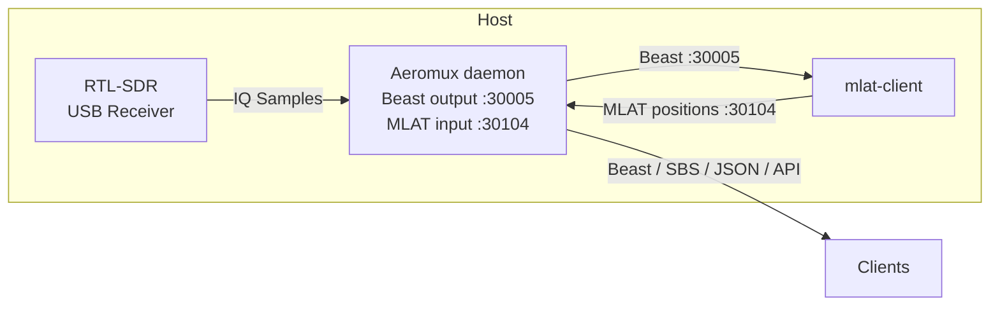

# Deployment Scenarios

Aeromux supports a range of deployment topologies, from a single RTL-SDR receiver on one machine to multi-site aggregation across a network. The unified input model allows any combination of local SDR devices and remote Beast TCP sources to be used together, with frames from all sources automatically aggregated and deduplicated by the tracker. This guide walks through seven common scenarios with complete configuration examples, progressing from the simplest single-device setup to advanced multi-site and MLAT-enabled deployments.

All scenarios assume you have already built Aeromux and have the binary available. See the [CLI Reference](CLI.md) for the full list of commands and parameters, and [`aeromux.example.yaml`](../aeromux.example.yaml) for a fully commented configuration template.

## Single SDR

The simplest and most common setup — one RTL-SDR device connected to one machine. This is the ideal starting point for anyone new to Aeromux or ADS-B reception in general. The SDR device receives 1090 MHz transponder signals directly, and Aeromux handles all demodulation, decoding, and output.

In **daemon mode**, Aeromux runs as a background service and serves decoded data over the network via TCP protocols (Beast, SBS, JSON) and a REST API. In **live mode**, it displays tracked aircraft in an interactive terminal interface. Both modes use the same SDR device configuration from the YAML file.



### Commands

```bash
# Daemon mode — runs in the background, serves data on network ports
aeromux daemon --config aeromux.yaml

# Live mode — interactive terminal display
aeromux live --config aeromux.yaml
```

### Configuration

The YAML file needs a single entry in the `sdrSources` section. The default values work well for most environments:

```yaml
sdrSources:
  - name: primary
    deviceIndex: 0
    gainMode: manual
    tunerGain: 49.6
    ppmCorrection: 0
    enabled: true
```

If you are located near an airport and experience strong signal overload (visible as a low message rate despite many aircraft overhead), reduce the `tunerGain` value. A good starting point for near-airport environments is 30–40 dB. Use `aeromux device --verbose` to list the gain values supported by your specific tuner.

## Multiple SDRs

Using two or more RTL-SDR devices on the same machine provides diversity reception — each device can be positioned with a different antenna orientation or location to cover blind spots, and Aeromux automatically merges and deduplicates frames from all devices. This is particularly effective when one antenna faces north and another faces south, or when one is optimized for high-altitude traffic and another for low approaches.

All SDR devices share a single ICAO confidence tracker, which means a weak signal detected by one device contributes to the confidence score alongside detections from the other devices. The FrameAggregator deduplicates identical frames received by multiple devices within the configured deduplication window.



### Commands

No special flags are needed — Aeromux automatically uses all enabled devices from the configuration:

```bash
aeromux daemon --config aeromux.yaml
```

### Configuration

List each device in the `sdrSources` section with a unique `deviceIndex`. The device indices correspond to the order in which the operating system enumerates the USB devices — use `aeromux device` to confirm which index maps to which physical device:

```yaml
sdrSources:
  - name: north-antenna
    deviceIndex: 0
    gainMode: manual
    tunerGain: 49.6
    ppmCorrection: 0
    enabled: true

  - name: south-antenna
    deviceIndex: 1
    gainMode: manual
    tunerGain: 49.6
    ppmCorrection: -2
    enabled: true
```

Each device can have independent gain, PPM correction, and preamble threshold settings. This is useful when the devices have different tuner characteristics or when the antennas are positioned in environments with different noise floors.

## Beast-Only (No Local SDR)

In this scenario, Aeromux does not use any local SDR hardware. Instead, it connects to one or more remote Beast-compatible TCP sources over the network — this can be dump1090, readsb, or another Aeromux daemon. This is useful when the SDR hardware is managed by another process or located on a different machine, or when you want to use Aeromux purely for its tracking, REST API, and output capabilities without needing a local receiver.

A common use case is connecting to an existing Aeromux daemon running on a Raspberry Pi. The daemon handles the SDR hardware and serves Beast output on port 30005. A second Aeromux instance — running on a server, desktop, or another Pi — connects to that Beast output and provides additional functionality such as the REST API, different output formats, or the live TUI.



### Commands

Use the `--beast-source` option to specify the remote host. The port defaults to 30005 if omitted:

```bash
# Connect to a remote Aeromux daemon
aeromux daemon --beast-source 192.168.1.100:30005 --config aeromux.yaml

# Connect to a remote dump1090 or readsb instance
aeromux daemon --beast-source piaware.local:30005 --config aeromux.yaml

# Connect to multiple Beast sources
aeromux daemon --beast-source 192.168.1.100:30005 --beast-source 192.168.1.101:30005 --config aeromux.yaml
```

Beast sources can also be configured in the YAML file instead of on the command line. CLI `--beast-source` options override the YAML `beastSources` section when both are specified:

```yaml
beastSources:
  - host: "192.168.1.100"
    port: 30005
```

### Connection Handling

Each Beast source includes automatic reconnection with exponential backoff. If the remote server goes down or the network connection drops, Aeromux will attempt to reconnect up to 5 times with increasing delays (5, 10, 20, 40, and 80 seconds). If all attempts fail, that Beast source is marked as unavailable and the remaining sources continue operating normally.

Each Beast source also has its own independent ICAO confidence tracker, which filters noise from real aircraft before frames are passed into the shared aggregator. This means a noisy remote source does not pollute the confidence scores of other sources.

## SDR + Beast Combined

This scenario combines a local SDR device with one or more remote Beast feeds on the same Aeromux instance. Frames from all sources — local and remote — are aggregated and deduplicated by the tracker, providing broader coverage than either source alone. This is useful when you have a local SDR receiver but also want to incorporate data from a neighbor's setup or a remote site.



### Commands

When Beast sources are specified on the command line, SDR sources are not used unless `--sdr-source` is explicitly included. This is a deliberate design choice — specifying `--beast-source` alone signals that you want Beast-only mode. To combine both, include `--sdr-source`:

```bash
# SDR + one Beast source
aeromux daemon --sdr-source --beast-source 192.168.1.100:30005 --config aeromux.yaml

# SDR + multiple Beast sources
aeromux daemon --sdr-source --beast-source 192.168.1.100:30005 --beast-source 192.168.1.101:30005 --config aeromux.yaml
```

When both `sdrSources` and `beastSources` are defined in the YAML file and no CLI source flags are provided, Aeromux automatically uses both:

```yaml
sdrSources:
  - name: local
    deviceIndex: 0
    tunerGain: 49.6
    enabled: true

beastSources:
  - host: "192.168.1.100"
    port: 30005
```

```bash
# Uses both SDR and Beast from YAML automatically
aeromux daemon --config aeromux.yaml
```

### How Aggregation Works

SDR devices and MLAT share a single ICAO confidence tracker, which allows cross-source confidence sharing — an aircraft detected by the SDR device contributes to the same confidence score as one detected via MLAT. Beast sources, however, each have their own independent confidence tracker. This design prevents a noisy remote feed from lowering the confidence threshold for locally received aircraft.

All confident frames from all sources are fed into a single FrameAggregator, which handles deduplication and ordering. Subscribers (TCP broadcasters, the TUI display, the REST API) receive a single unified stream of `ProcessedFrame` data regardless of the original source.

## Multi-Site Aggregator

This is the flagship multi-site topology for maximizing reception coverage. Two or more remote sites — typically Raspberry Pis with RTL-SDR devices — each run an Aeromux daemon with Beast output enabled. A central server runs Aeromux as a pure aggregator, connecting to all remote daemons via Beast TCP. The central server has no SDR hardware of its own; it combines the feeds from all remote sites into a single unified view with full tracking, REST API, and output protocol support.

This setup is ideal for covering a large geographic area where no single antenna position can see all traffic, or for combining feeds from multiple observers in a local community.



### Remote Site Configuration (each Raspberry Pi)

Each remote site runs a minimal Aeromux daemon with Beast output enabled. Only the Beast output is needed — SBS, JSON, and the REST API can be disabled to minimize resource usage on the Pi:

```yaml
# aeromux.yaml on each Raspberry Pi
sdrSources:
  - name: local-sdr
    deviceIndex: 0
    tunerGain: 49.6
    enabled: true

network:
  beastOutputPort: 30005
  beastOutputEnabled: true
  jsonOutputEnabled: false
  sbsOutputEnabled: false
  apiEnabled: false
```

```bash
# On each Raspberry Pi
aeromux daemon --config aeromux.yaml
```

### Central Server Configuration

The central server connects to all remote sites via Beast and enables the full set of output protocols and the REST API:

```yaml
# aeromux.yaml on the central server
beastSources:
  - host: "192.168.1.100"    # Site A (Raspberry Pi)
    port: 30005
  - host: "192.168.1.101"    # Site B (Raspberry Pi)
    port: 30005

network:
  beastOutputPort: 30005
  beastOutputEnabled: true
  jsonOutputPort: 30006
  jsonOutputEnabled: true
  sbsOutputPort: 30003
  sbsOutputEnabled: true
  apiPort: 8080
  apiEnabled: true
```

```bash
# On the central server (no SDR hardware needed)
aeromux daemon --config aeromux.yaml
```

Alternatively, the Beast sources can be specified entirely on the command line without a `beastSources` section in the YAML:

```bash
aeromux daemon --beast-source 192.168.1.100:30005 --beast-source 192.168.1.101:30005 --config aeromux.yaml
```

### Scaling

This topology scales linearly — adding a third site is simply a matter of adding another `beastSources` entry on the central server and starting a new daemon on the remote Pi. Each Beast connection is independent, so the failure of one remote site does not affect the others. The automatic reconnection logic ensures that if a remote site reboots or temporarily loses network connectivity, the central server will reconnect automatically once the site comes back online.

## Live Monitoring from a Laptop

A developer or operator can run `aeromux live` on their laptop to get a real-time terminal display of all tracked aircraft, without needing any SDR hardware on the laptop. The laptop connects to a remote Aeromux daemon (or any Beast-compatible source) over the network and receives the live data stream.

This is useful for monitoring a headless daemon running on a Raspberry Pi, for debugging reception quality from a different room, or for demonstrating Aeromux to someone without giving them access to the production server.



### Commands

```bash
# Connect to a remote daemon and display the live TUI
aeromux live --beast-source 192.168.1.100:30005 --config aeromux.yaml

# Connect using a hostname
aeromux live --beast-source piaware.local --config aeromux.yaml

# Combined mode — local SDR + remote daemon together in the TUI
aeromux live --sdr-source --beast-source 192.168.1.100:30005 --config aeromux.yaml
```

The live TUI supports all the same features regardless of whether the data comes from a local SDR or a remote Beast source — sorting, search, detail view, display unit switching, and aircraft database enrichment all work identically. See the [TUI Guide](TUI.md) for the full keyboard reference.

### Configuration

The laptop's YAML file only needs tracking and receiver configuration. The `sdrSources` section can be omitted entirely when using Beast-only mode:

```yaml
tracking:
  confidenceLevel: medium
  icaoTimeoutSeconds: 30

receiver:
  latitude: 46.907982
  longitude: 19.693172
  altitude: 120

database:
  enabled: true
  path: "artifacts/db/"
```

The receiver location is used for distance calculation in the TUI. If omitted, the Distance column displays `N/A`. The aircraft database provides registration, operator, and type information in the detail view.

## MLAT Integration

Multilateration (MLAT) enables position tracking for aircraft that do not broadcast ADS-B positions — typically older transponders that only respond to radar interrogations. MLAT works by collecting the same transponder signal at multiple geographically separated receivers and using the time difference of arrival to triangulate the aircraft's position. The mlat-client software performs this calculation and feeds the resulting positions back to Aeromux.

In this scenario, Aeromux runs in daemon mode with a local SDR device for direct reception and an MLAT input port for receiving positions from mlat-client. The receiver UUID is required for MLAT triangulation — it uniquely identifies this receiver in the MLAT network and must not be shared with other receivers, as duplicate UUIDs corrupt the timing correlation.



### Commands

MLAT input is enabled by default in daemon mode. The receiver UUID can be set via CLI or in the YAML file:

```bash
aeromux daemon --receiver-uuid "550e8400-e29b-41d4-a716-446655440000" --config aeromux.yaml
```

The mlat-client connects to the Aeromux Beast output to read raw frames, and feeds computed positions back on the MLAT input port:

```bash
mlat-client --input-type beast --input-connect localhost:30005 \
            --results beast,connect,localhost:30104 \
            --server mlat.example.com:12345 \
            --lat 46.907982 --lon 19.693172 --alt 120
```

### Configuration

```yaml
sdrSources:
  - name: primary
    deviceIndex: 0
    tunerGain: 49.6
    enabled: true

receiver:
  latitude: 46.907982
  longitude: 19.693172
  altitude: 120
  receiverUuid: "550e8400-e29b-41d4-a716-446655440000"

mlat:
  enabled: true
  inputPort: 30104

network:
  beastOutputPort: 30005
  beastOutputEnabled: true
```

Generate a unique UUID with `uuidgen` (macOS/Linux), `[guid]::NewGuid()` (PowerShell), or any online UUID generator. Each receiver must have its own unique UUID.

### How MLAT Positions Are Handled

MLAT-computed positions are received as Beast binary frames on the configured MLAT input port (default: 30104). These frames are parsed, decoded, and fed into the same FrameAggregator as SDR frames, but they are tagged with `Source=Mlat` so that downstream consumers can distinguish them from directly received positions. In the REST API, the `HadMlatPosition` field on the Position section indicates whether the aircraft has ever had an MLAT-derived position.

MLAT frames share the same ICAO confidence tracker as local SDR devices. This means an MLAT detection can contribute to the confidence score for an aircraft that the local SDR is also receiving, and vice versa. Beast TCP input sources, by contrast, each have their own independent confidence tracker — this design prevents a noisy remote feed from interfering with the local confidence filtering.

MLAT input is only available in daemon mode. The live command does not accept MLAT configuration, as MLAT requires the Beast output port to feed frames to mlat-client, which is a daemon-mode feature.

## See Also

- [CLI Reference](CLI.md) — All commands, parameters, configuration priority model, and source resolution
- [TUI Guide](TUI.md) — Live mode keyboard reference, sorting, search, and detail view
- [REST API](API.md) — Endpoints, response format, rate limiting, and usage examples
- [TCP Broadcast](BROADCAST.md) — Beast, SBS, and JSON output protocol details
- [Architecture Guide](ARCHITECTURE.md) — Internal data flow, signal processing pipeline, and concurrency model
