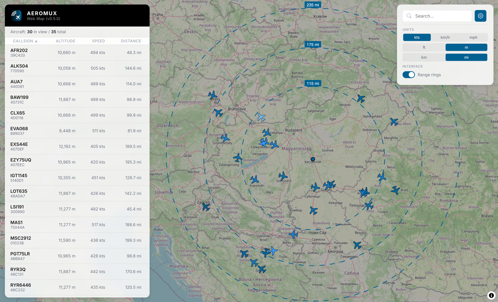
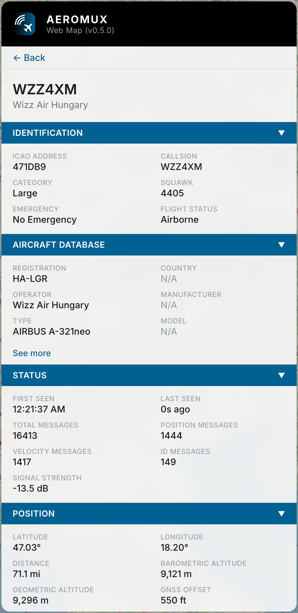
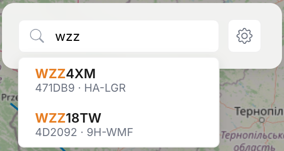
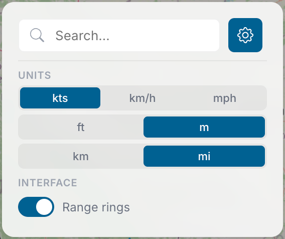

# Web Map

Aeromux includes a built-in web-based map for real-time aircraft visualization. The map is served directly by the daemon and embedded into the single-file binary. No external web server, separate process, or additional configuration is required.

<div align="center">
  
  <br>
  <em>The web map showing aircraft list, map with range rings, and control panel</em>
</div>

## Access

The web map is available whenever the REST API is enabled. Navigate to the daemon's API address in any browser:

```
http://<bind-address>:<api-port>/
```

There is no separate flag — enabling the API implicitly enables the map:

```bash
# Map available at http://localhost:8080/
aeromux daemon --api-enabled --api-port 8080 --config aeromux.yaml

# Map available from other machines at http://<host>:8080/
aeromux daemon --api-enabled --api-port 8080 --bind-address 0.0.0.0 --config aeromux.yaml
```

When `apiEnabled` is `false`, the HTTP server is not started and neither the API nor the map is available.

## Map

The main area of the screen is a full-screen interactive map rendered using OpenStreetMap raster tiles. A dark overlay is applied on top of the map tiles to improve contrast with the aircraft markers.

Aircraft are displayed as rotated plane markers whose color reflects altitude — lighter blue at ground level, deeper blue at cruise altitude. The currently selected aircraft is highlighted in orange. Hovering over any aircraft shows a tooltip with the callsign, ICAO address, speed, and altitude.

When an aircraft is selected, a blue gradient trail is drawn along its recent flight path. The trail is fetched from the position history on selection and extended in real-time as new positions arrive. The trail fades from transparent (oldest position) to opaque (newest position).

### Range Rings

Three range rings centered on the receiver location indicate distances of 115, 175, and 235 miles from the receiver. Each ring is labeled with its distance, displayed in the currently selected distance unit (miles or kilometers). The receiver location is marked with a small blue circle at the center.

Range rings can be toggled on or off from the settings panel. They are enabled by default. When the receiver location is not configured, range rings are not displayed.

## Aircraft List (Left Panel)

The left panel displays the Aeromux logo and version at the top, followed by a statistics row showing the number of aircraft currently in view and the total number of tracked aircraft:

```
Aircraft: 12 in view / 34 total
```

Below the statistics row is a scrollable table of all aircraft visible on the current map viewport. Each row shows:

| Column | Description |
|--------|-------------|
| Callsign | The flight callsign (or `N/A` if not yet received), with the ICAO address displayed below it |
| Altitude | Barometric altitude in the currently selected unit |
| Speed | Ground speed in the currently selected unit |
| Distance | Distance from the receiver, when the receiver location is configured |

### Sorting

The aircraft list can be sorted by clicking any column header. Clicking the same header again toggles between ascending and descending order. The currently active sort column and direction are indicated by a ▲ or ▼ arrow next to the column name.

Aircraft that have no data for the sort column (displayed as `N/A`) are always placed at the bottom of the list, regardless of whether the sort direction is ascending or descending. When two aircraft have identical values for the sort column, the ICAO address is used as a tiebreaker.

The default sort is by callsign in ascending order. Sort preferences are persisted in the browser and restored on the next visit.

## Aircraft Detail (Left Panel)

Clicking an aircraft in the list or on the map opens the detail view, which replaces the aircraft list in the left panel. The detail view displays all available information about the aircraft organized into collapsible sections. A back button at the top returns to the aircraft list.

<div align="center">
  
  <br>
  <em>Aircraft detail view with collapsible sections</em>
</div>

The detail view is organized into the following sections:

- **Identification** — The aircraft's ICAO address, callsign, wake turbulence category, squawk code, and emergency state.
- **Aircraft Database** — Static metadata from the [aeromux-db](https://github.com/aeromux/aeromux-db) database, including registration, operator, manufacturer, aircraft type, and regulatory flags such as FAA PIA and LADD.
- **Status** — Timestamps for when the aircraft was first and last seen, message counts broken down by type (position, velocity, identification), and the current signal strength.
- **Position** — Geographic coordinates, distance from the receiver, barometric and geometric altitudes with their delta, ground state, and position source.
- **Velocity & Dynamics** — Ground speed, airspeed, heading, track angle, vertical rate, roll angle, Mach number, magnetic declination, turn rate, and surface movement data.
- **Autopilot** — Selected altitude and heading, barometric pressure setting, and autopilot mode flags (VNAV, LNAV, altitude hold, approach).
- **Meteorology** — Wind speed and direction, static and total air temperatures, atmospheric pressure, radio height, and hazard severity levels for turbulence, wind shear, microburst, icing, and wake vortex.
- **ACAS/TCAS** — TCAS operational status, sensitivity level, cross-link capability, resolution advisory state and complement, and threat encounter details.
- **Capabilities** — Transponder level, ADS-B version, data link feature support (1090ES, UAT, CDTI), operational flags, aircraft dimensions, GPS antenna offsets, downlink request, utility message, data link capability, and supported BDS registers.
- **Data Quality** — Navigation accuracy (NACp, NACv), navigation integrity (NICbaro, NIC supplements), surveillance integrity (SIL), geometric vertical accuracy, antenna configuration, and system design assurance level.

Sections 1 through 5 are expanded by default; sections 6 through 10 are collapsed. Sections with many fields include a "See more" link to reveal additional details. The detail view updates in real-time as new data is received. If the selected aircraft expires (no messages received within the timeout period), an `[EXPIRED]` banner is displayed at the top of the detail view.

## Control Panel (Top Right)

The control panel in the top-right corner provides search and settings functionality.

### Search

The search input accepts any text and performs a case-insensitive substring match against the callsign, ICAO address, squawk code, and registration of all tracked aircraft. Results appear in a dropdown below the search input as you type.

<div align="center">
  
  <br>
  <em>Search results with highlighted matching text</em>
</div>

Each result shows the callsign (or ICAO address if no callsign is available) and metadata (ICAO address and registration). The matched portion of the text is highlighted in orange. Clicking a result selects the aircraft and opens its detail view.

### Settings

The gear icon next to the search input opens the settings dropdown, which provides controls for display units and interface options.

<div align="center">
  
  <br>
  <em>Settings dropdown with unit controls and range rings toggle</em>
</div>

#### Units

Three measurement units can be switched independently:

| Unit | Options | Default |
|------|---------|---------|
| Speed | Knots (kts) / km/h / mph | Knots |
| Altitude | Feet (ft) / Meters (m) | Feet |
| Distance | Kilometers (km) / Miles (mi) | Kilometers |

Unit changes are applied immediately across the entire interface — the aircraft list, detail view, hover tooltip, and range ring labels all update to reflect the selected units. Unit preferences are persisted in the browser and restored on the next visit.

#### Interface

| Option | Description | Default |
|--------|-------------|---------|
| Range rings | Show or hide the range rings on the map | On |

## Browser Requirements

The web map requires a modern browser with WebGL support:

| Browser | Minimum Version |
|---------|----------------|
| Chrome | 120+ |
| Firefox | 117+ |
| Safari | 17.2+ |
| Edge | 120+ |
| Samsung Internet | 25+ |
