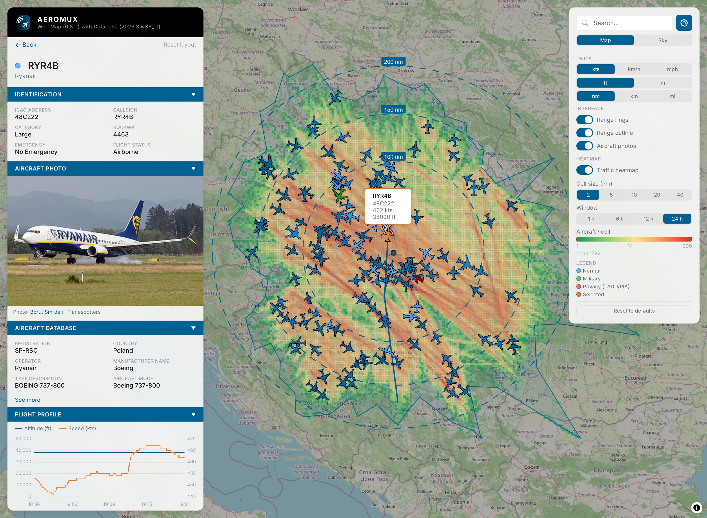
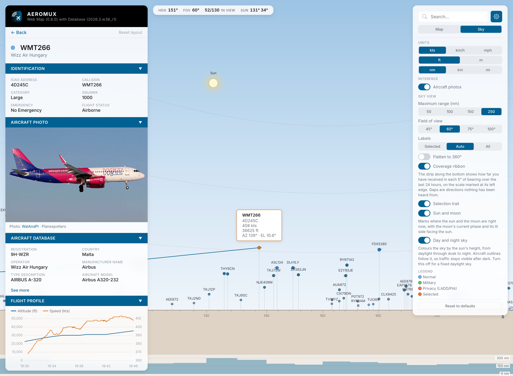
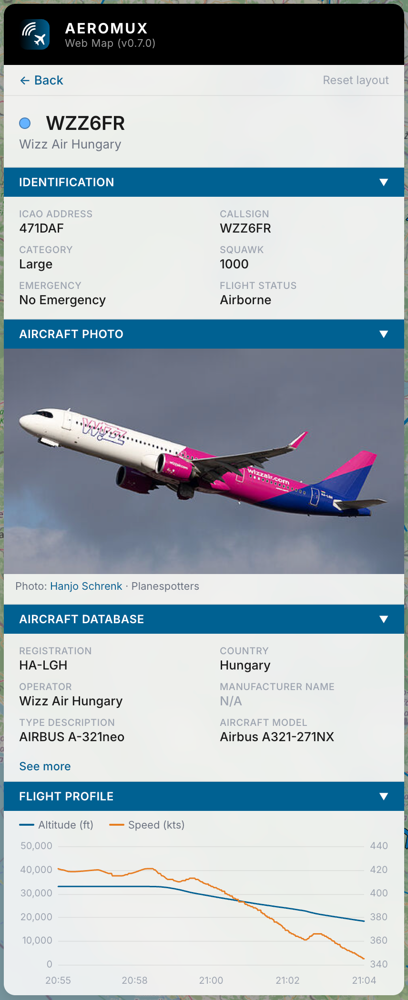
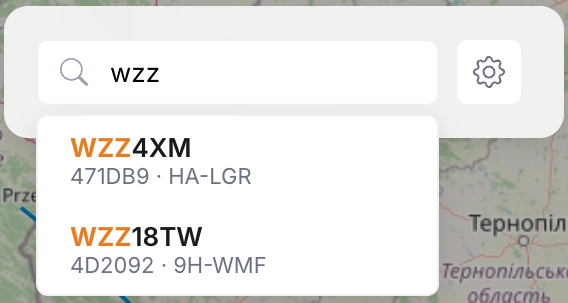
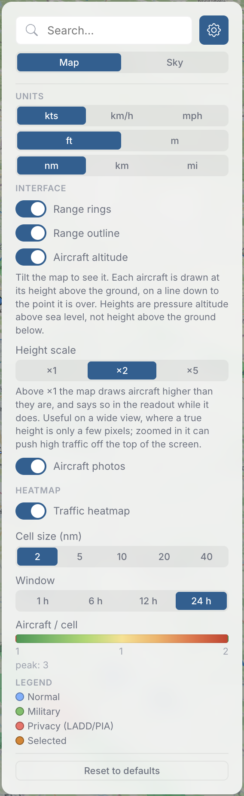
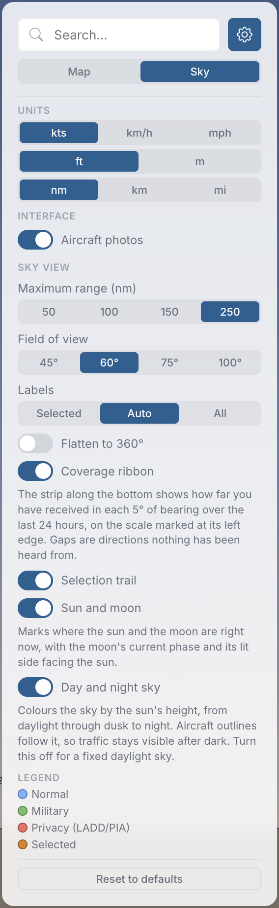

# Web Map

Aeromux includes a built-in web interface for real-time aircraft visualization. It is served directly by the daemon and embedded into the single-file binary, so no external web server, separate process, or additional configuration is required.

The interface provides two views of the same traffic. The **Map** plots aircraft geographically on OpenStreetMap tiles, answering "where are the aircraft on the Earth?". The **Sky View** places the same aircraft by bearing and elevation as seen from the antenna, answering "if I look in this direction, where in the sky is each one?". A `Map` / `Sky` control in the top-right panel switches between them, and both share the same selection, detail panel, and search.

<div align="center">
  
  <br>
  <em>The Map view with the traffic heatmap, range rings, the measured coverage outline, an aircraft's detail panel, and the settings dropdown open</em>
</div>

## Configuration

The web map is served whenever the REST API is enabled. There is no separate flag: enabling the API implicitly enables the map. Navigate to the daemon's API address in any browser:

```
http://<bind-address>:<api-port>/
```

Several features depend on settings elsewhere in `aeromux.yaml`. The relevant keys are:

```yaml
network:
  apiEnabled: true
  apiPort: 8080
  bindAddress: "0.0.0.0"

receiver:
  latitude: 46.907982
  longitude: 19.693172
  altitude: 120

heatmap:
  collect: true
```

| Setting | What it affects in the web map | Default |
|---------|--------------------------------|---------|
| `network.apiEnabled` | Whether the map is served at all. When `false`, the HTTP server is not started and neither the API nor the map is available. | `true` |
| `network.apiPort` | The port the map is served on | `8080` |
| `network.bindAddress` | Which interface to listen on. `0.0.0.0` reaches other machines on the network, `127.0.0.1` is local only. | `0.0.0.0` |
| `receiver.latitude`, `receiver.longitude` | Range rings, the range outline, distances in the aircraft list, and the Sky View itself. Without a receiver location the `Sky` button is disabled. | Not set |
| `receiver.altitude` | Horizon accuracy in the Sky View. Optional, but it matters for elevated sites. | Not set |
| `heatmap.collect` | Whether the daemon aggregates the traffic-density grid. When `false`, the heatmap toggle is grayed out. | `true` |
| `tracking.enableStateHistory` | The flight profile chart in the detail panel | `true` |
| `tracking.enablePositionHistory` | The trail drawn behind a selected aircraft | `true` |

The same network settings can be given on the command line:

```bash
# Map available at http://localhost:8080/
aeromux daemon --api-enabled --api-port 8080 --config aeromux.yaml

# Map available from other machines at http://<host>:8080/
aeromux daemon --api-enabled --api-port 8080 --bind-address 0.0.0.0 --config aeromux.yaml
```

## Map

The main area of the screen is a full-screen interactive map rendered using OpenStreetMap raster tiles. A dark overlay is applied on top of the map tiles to improve contrast with the aircraft markers.

The map is the default of the two views. See [Sky View](#sky-view) for the receiver-centric alternative, which shows the same aircraft as they appear in the sky above the antenna rather than on the ground.

Aircraft are displayed as top-down silhouettes specific to each aircraft type (A320, B777, Cessna, helicopter, balloon, …), rotated by heading, and sized for comfortable on-screen visibility at typical map zoom levels. Marker color reflects altitude: lighter blue at ground level, deeper blue at cruise altitude. Military aircraft use a green palette, and privacy aircraft (LADD / PIA) use red. The currently selected aircraft is highlighted in orange. Hovering over any aircraft shows a tooltip with the callsign, ICAO address, speed, and altitude.

The selected aircraft keeps a permanent (pinned) tooltip that follows it as it moves and as the map is panned or zoomed. The pinned tooltip is distinguished by an accent border, and a second transient tooltip is shown simultaneously when hovering a different aircraft. The pinned tooltip clears when the aircraft is deselected or expires.

When an aircraft is selected, a blue gradient trail is drawn along its recent flight path. The trail is fetched from the position history on selection and extended in real time as new positions arrive. The trail fades from transparent (oldest position) to opaque (newest position).

### Readout

A row of readings sits in the top-left corner of the map, clear of the panels, telling you the scale of what is on screen and where it sits relative to the receiver.

| Reading | Meaning |
|---------|---------|
| `HDG` | The map's bearing, shown only while the map is rotated away from north. |
| `SPAN` | Ground distance across the middle of the map. |
| `AREA` | How much ground the map is showing. Absent while the map is tilted, where no honest figure exists: the top of the screen can be looking at the horizon. |
| `CTR` | Bearing and distance from the receiver to the center of the map. Needs a configured receiver location. Very close to the receiver only the distance is shown, the bearing there being meaningless. |
| `in view` | Aircraft on the map over aircraft being tracked, the same pair the aircraft list footer shows. |
| `RANGE` | The farthest the receiver has heard, taken from the coverage outline. Shown whether or not the outline itself is drawn. |

Distances follow the selected distance unit, and the area follows it into its square (nm², km², mi²). `SPAN` and `AREA` measure the whole map, including the part behind the left panel, which is also the area the aircraft count beside them covers. On a phone-width screen the row drops `AREA` and `RANGE` to fit.

### Aircraft Icon Resolution

The icon shape for each aircraft is selected by a six-layer fall-through:

1. **ICAO type designator**: direct lookup (for example `A320` → airliner-shape `a320`, `B77W` → `heavy_2e`).
2. **3-character type description + WTC**: a composite key such as `L2J-H` distinguishes a heavy 777 from a medium-weight CRJ.
3. **3-character type description (bare)**: a fallback for when wake turbulence is missing. It includes synthesized entries for classes that tar1090 ships only as WTC-suffixed (`L2J` → `airliner`, `L3J` → `md11`).
4. **First character of type description**: `H` → helicopter, `G` → gyrocopter.
5. **ADS-B emitter category**: `Light`, `Heavy`, `Rotorcraft`, and so on, taken from the downlink itself, so a sensible shape renders even without a database hit.
6. A generic `unknown` silhouette is the universal fallback when every layer above misses.

Shape data and lookup tables are derived from [tar1090](https://github.com/wiedehopf/tar1090). See the project `README.md` for full attribution.

### Range Rings

Three range rings centered on the receiver location indicate distances of 100, 150, and 200 nautical miles from the receiver. Each ring is labeled with its distance, displayed in the currently selected distance unit (nautical miles, kilometers, or miles). The receiver location is marked with a small blue circle at the center.

Range rings can be toggled on or off from the settings panel. They are enabled by default. When the receiver location is not configured, range rings are not displayed.

### Range Outline

A polygon showing the receiver's coverage area, connecting the farthest aircraft position received in each 5-degree bearing sector. Empty sectors are skipped, so the shape follows actual reception coverage and can be irregular rather than smoothly convex. The outline grows over time as aircraft are received in new directions and at greater distances. Positions beyond 300 nm from the receiver are discarded. The outline uses a 24-hour sliding window and resets when the daemon is restarted.

The range outline can be toggled on or off from the settings panel. It is enabled by default. When the receiver location is not configured, the toggle is disabled.

### Traffic Heatmap

An optional overlay that divides the map into a grid of equal-size squares and colors each by how many **distinct aircraft** (unique ICAO addresses) passed through it over a recent time window (24 hours by default). Colors run from green (least busy) through yellow to red (busiest), on a logarithmic scale so that everyday and very busy squares remain distinguishable. Over time the overlay traces out the approach and departure corridors, holding patterns, and airways over the receiver's coverage.

Squares are a fixed size in nautical miles regardless of the selected distance unit, so switching units never resizes the grid, and only the cell-size labels are converted to the chosen unit. Only squares where aircraft were actually seen are drawn, so empty areas show the plain map. Hovering (or tapping) a square shows its exact aircraft count, and the settings panel's Heatmap section shows a color-scale legend.

The heatmap is **off by default** and toggled from the settings panel, which also carries its cell-size and window controls. See [Heatmap](#heatmap) for the available values. The overlay is held in memory and is not persisted, so a daemon restart clears it and it refills over the following window.

Server-side collection is controlled by the `heatmap.collect` option in the configuration file (default on). When collection is disabled, no data is gathered and the settings toggle is grayed out with an explanatory note.

## Sky View

An alternative view that shows where aircraft are **relative to the receiver** rather than relative to the ground. Where the map answers "where are the aircraft on the Earth?", the Sky View answers "if I stand at my antenna and look in this direction, where in the sky is each aircraft?".

<div align="center">
  
  <br>
  <em>The Sky View with the sun marked at its real position, aircraft at their bearing and elevation, the compass and coverage ribbon along the foot, and the Sky settings open</em>
</div>
<br>

The view is a perspective window on the sky: a virtual camera at the receiver's configured position and altitude, looking along a heading you control. Aircraft are placed by bearing and elevation angle, sized and hazed by distance, and tied to their bearing by a thin stem down to the horizon. Selecting an aircraft works exactly as it does on the map: the same detail panel, photo, and flight profile chart appear in the left panel, and the selection survives switching between views.

Sky View **requires a configured receiver location**, and without one the `Sky` button is disabled. Setting `receiver.altitude` as well is optional but improves accuracy for elevated sites, since the horizon depends on antenna height. See [Configuration](#configuration).

### Switching Views

A `Map` / `Sky` control sits in the control panel at the top right, directly below the search box. The chosen view is remembered in the browser. Switching never clears the current selection: select an aircraft on the map, switch to Sky, and the camera swings around to face it.

### Moving the Camera

| Action | Effect |
|--------|--------|
| Drag left / right | Turn the camera. The scene follows your pointer one-to-one, so whatever you grab stays under it. |
| Drag up / down | Tilt up toward the zenith. Tilting far enough carries the horizon out of the frame, which is what looking up means. |
| Scroll, or pinch | Field of view, 30°–120°. Pinch two fingers apart to zoom in, together to zoom out. Also selectable in the settings panel. In flattened mode there is no field of view to change, so pinch does nothing there. |
| Click / tap an aircraft | Select it |
| Click / tap empty sky | Deselect |
| Double-click / double-tap | Reset heading, tilt, and field of view. On a double-tap the second tap only resets and does not also select. |

At rest the camera is level and the horizon sits low in the frame, so the sky gets most of the view and the ground (which has nothing drawn on it) gets little. Traffic is concentrated near the horizon: at 20 nm even an aircraft at FL350 is only about 16° above it, and it takes a pass within a few miles to climb past 40°. A level camera covers roughly 0–39° of elevation, which contains almost everything.

### What You See

| Element | Meaning |
|---------|---------|
| Elevation grid | Arcs at 10°, 20°, 30°, 45° and 60° above the horizon. Deliberately uneven: nearly all traffic sits below 30°, so the grid is tighter low down. |
| Compass | Bearing along the horizon: a tick every 10°, a number every 30°, and a letter at `N` / `E` / `S` / `W`. When tilting up carries the horizon out of view, the compass moves down to sit above the coverage ribbon so bearings stay readable. |
| Horizon | Level for a receiver at sea level, slightly below level for an elevated one. |
| Aircraft | Colored by altitude using the same palette as the map: lighter at ground level, deeper at cruise, green for military, red for LADD/PIA, orange when selected. Nearer aircraft are drawn larger and more opaque. A short tick shows the direction of travel. |
| Sub-horizon marks | Flattened marks sitting **on** the horizon, for aircraft hidden by the curve of the Earth: surface traffic, and very low traffic far away. Their true (negative) elevation is still shown in the tooltip. |
| Sun and moon | Both bodies at their real positions, the moon with its current phase and its lit side facing the sun, on a sky tinted by the sun's height. See [Sun and Moon](#sun-and-moon). |
| Coverage ribbon | A strip along the foot of the view showing how far you actually receive in each direction. See below. |
| Readout | Camera heading, field of view, how many aircraft are in view versus in range, and counts of any shown as sub-horizon marks or omitted for having no altitude. The sun and the moon are listed as well while they are up, each with its bearing and elevation, the moon also with its illuminated percentage. |

There are deliberately **no range rings and no ground plane**. At a realistic antenna height the visible ground is a sliver at the horizon (a 10 m rooftop antenna sees only about 6.6 nm of ground before the Earth curves away), so rings would be invisible rather than merely cluttered. Distance is carried by the tooltips and the coverage ribbon instead.

### Coverage Ribbon

The strip along the bottom shows the farthest aircraft received in each 5° of bearing over the last 24 hours. These are the same measurements the map draws as a range outline, laid out against bearing instead of on a map. A notch is a direction nothing has been heard from, which over time traces out where buildings or terrain block the antenna.

Its scale is marked down the left edge, each tick labeled in the current distance unit. The scale is the farthest bearing rounded up to the next step in that unit (50 nm, 100 km, or 50 mi), so a given height means a fixed distance rather than rescaling every time a distant contact arrives, and the ticks stay round numbers whichever unit you read them in. Changing the distance unit therefore changes the scale as well as the labels. It is computed across all bearings, not just the ones on screen, which is why the visible profile often does not fill the band. That keeps heights comparable as you turn the camera.

The ribbon needs at least three bearings with contacts before it appears, so a freshly started daemon shows nothing until traffic has been seen in a few directions. It can be turned off in the settings panel.

### Sun and Moon

The Sky View marks where the sun and the moon actually are, so the view matches what you would see looking in that direction.

Both are drawn at their apparent positions, the ones an observer on the surface sees rather than the geocentric ones: the moon is corrected for parallax, and both for atmospheric refraction. Skipping either correction would place a marker about a degree from where the body plainly is, and a degree is two full moon diameters. The moon carries its current phase, with its lit side facing the sun, so the shape on screen is the shape in the sky. Each body stays drawn until its upper limb has set, so the sun does not vanish the moment its center reaches the horizon.

Both are labeled, and their labels are placed before any aircraft callsigns, so the two fixed points in the view keep their labels and the callsigns arrange themselves around them. While a body is up, the readout reports its bearing and elevation, and for the moon the percentage of its disc that is lit.

The sky is colored by the sun's elevation through five phases: day, golden, civil twilight, nautical twilight, and night. Colors are interpolated between neighboring phases, so dusk is a continuous change rather than a set of steps, and the band below the horizon follows along, since a bright ground glows against a night sky.

Tinting the sky has one consequence worth knowing about. The aircraft colors were chosen against a pale daylight sky, and at civil twilight a mid-blue background sits almost exactly on the dark end of the altitude ramp, which would take cruise and military traffic to roughly 1.2:1 contrast. A black outline on a night sky is worse still, at 1.12:1. Because a chip in the Sky View is found by its outline rather than its fill, the outline follows the sky, dark on a light sky and light on a dark one, while the fills are left exactly as they are. The altitude ramp therefore keeps the meaning it has in daylight.

The markers and the sky coloring are separate settings, `Sun and moon` and `Day and night sky`, both on by default. Turning off `Day and night sky` gives a fixed daylight sky at any hour.

### Accuracy

Elevation angles account for the receiver's altitude, the curvature of the Earth, and atmospheric refraction. This matters more than it sounds: an aircraft at 10 km and 300 km away sits less than a degree above the horizon, where naive flat-Earth geometry would place it at nearly 2°, floating in clear sky instead of grazing the horizon.

Geometric (GNSS) altitude is used when an aircraft reports it, falling back to barometric otherwise. Because barometric altitude is always referenced to standard pressure, that fallback can be out by around 1 000 ft in a non-standard atmosphere. Combined with the small difference between the GNSS and sea-level altitude references, elevation angles are good to roughly a degree for close traffic. That is ample for knowing where to look, but it is not a survey instrument.

### 360° Flattened Mode

A **Flatten to 360°** toggle switches from the camera-like view to a single panorama of the whole sky, with bearing running across the full width. Dragging scrolls it so the bearing of interest sits center-frame, and tilt and field of view no longer apply.

Use it to see everything at once, including traffic directly overhead. Use the default view to see what you would actually see looking in one direction.

## Left Panel

The left panel shows either the aircraft list or, once an aircraft is selected, its detail view. Both states share the panel's header, its mobile sheet behavior, and the **Reset layout** button.

### Aircraft List

The panel displays the Aeromux logo and version at the top, followed by a statistics row showing the number of aircraft currently in view and the total number of tracked aircraft:

```
Aircraft: 12 in view / 34 total
```

Below the statistics row is a scrollable table of all aircraft visible on the current map viewport. Each row shows:

| Column   | Description                                                                                   |
|----------|-----------------------------------------------------------------------------------------------|
| Callsign | The flight callsign (or `N/A` if not yet received), with the ICAO address displayed below it  |
| Altitude | Barometric altitude in the currently selected unit                                            |
| Speed    | Ground speed in the currently selected unit                                                   |
| Distance | Distance from the receiver, when the receiver location is configured                          |

#### Sorting

The aircraft list can be sorted by clicking any column header. Clicking the same header again toggles between ascending and descending order. The currently active sort column and direction are indicated by a ▲ or ▼ arrow next to the column name.

Aircraft that have no data for the sort column (displayed as `N/A`) are always placed at the bottom of the list, regardless of whether the sort direction is ascending or descending. When two aircraft have identical values for the sort column, the ICAO address is used as a tiebreaker.

The default sort is by callsign in ascending order. Sort preferences are persisted in the browser and restored on the next visit.

### Aircraft Detail

Clicking an aircraft in the list or on the map opens the detail view, which replaces the aircraft list in the left panel. The detail view displays all available information about the aircraft organized into collapsible sections. A back button at the top returns to the aircraft list.

<div align="center">
  
  <br>
  <em>Aircraft detail view with collapsible sections</em>
</div>
<br>

The detail view is organized into the following sections:

- **Identification**: The aircraft's ICAO address, callsign, wake turbulence category, squawk code, and emergency state.
- **Aircraft Photo**: A representative photo of the airframe sourced from [Planespotters.net](https://www.planespotters.net/), with photographer attribution and a link back to the photo's page on planespotters.net. Lazy-loaded on selection. Aeromux caches the photo metadata only, and the browser fetches the JPEG directly from Planespotters' CDN. The section can be toggled off entirely from the settings panel.
- **Aircraft Database**: Static metadata from the [aeromux-db](https://github.com/aeromux/aeromux-db) database, including registration, operator, manufacturer, aircraft type, and regulatory flags such as FAA PIA and LADD.
- **Flight Profile**: A dual-axis chart showing barometric altitude (blue line, left axis) and ground speed (orange line, right axis) over time. The chart loads historical data on selection and extends in real time as new state updates arrive. A legend above the chart indicates the color and unit for each series. When state history is not enabled or no data is available, an informational message is shown instead.
- **Status**: Timestamps for when the aircraft was first and last seen, message counts broken down by type (position, velocity, identification), and the current signal strength.
- **Position**: Geographic coordinates, distance from the receiver, barometric and geometric altitudes with their delta, ground state, and position source.
- **Velocity & Dynamics**: Ground speed, airspeed, heading, track angle, vertical rate, roll angle, Mach number, magnetic declination, turn rate, and surface movement data.
- **Autopilot**: Selected altitude and heading, barometric pressure setting, and autopilot mode flags (VNAV, LNAV, altitude hold, approach).
- **Meteorology**: Wind speed and direction, static and total air temperatures, atmospheric pressure, radio height, and hazard severity levels for turbulence, wind shear, microburst, icing, and wake vortex.
- **ACAS/TCAS**: TCAS operational status, sensitivity level, cross-link capability, resolution advisory state and complement, and threat encounter details.
- **Capabilities**: Transponder level, ADS-B version, data link feature support (1090ES, UAT, CDTI), operational flags, aircraft dimensions, GPS antenna offsets, downlink request, utility message, data link capability, and supported BDS registers.
- **Data Quality**: Navigation accuracy (NACp, NACv), navigation integrity (NICbaro, NIC supplements), surveillance integrity (SIL), geometric vertical accuracy, antenna configuration, and system design assurance level.

Sections 1 through 7 are expanded by default, and sections 8 through 12 are collapsed. Sections with many fields include a "See more" link to reveal additional details. The detail view updates in real time as new data is received. If the selected aircraft expires (no messages received within the timeout period), an `[EXPIRED]` banner is displayed at the top of the detail view.

### Resizing the Panel (Mobile)

On phone-sized screens the left panel is docked to the bottom of the screen as a sheet rather than floating on the left. A drag handle along its top edge (the pill, or anywhere on the AEROMUX header) lets you raise or lower the sheet to trade off how much of the map versus the list or detail is visible. The chosen height is saved in the browser and restored on the next visit. Tablet and desktop layouts place the panel on the left at full height and are not resizable.

### Reset Layout

A **Reset layout** button restores the panel to its defaults: the expanded and collapsed state of the detail sections (including any expanded "See more" details) and, on mobile, the saved sheet height. It appears on all screen sizes in both views, to the right of the aircraft count in the list and in the detail toolbar next to the back button. This is separate from the settings "Reset to defaults", which clears units, interface options, and sort preferences.

## Control Panel (Top Right)

The control panel in the top-right corner provides search, the `Map` / `Sky` view switch, and settings functionality.

### Search

The search input accepts any text and performs a case-insensitive substring match against the callsign, ICAO address, squawk code, and registration of all tracked aircraft. Results appear in a dropdown below the search input as you type.

<div align="center">
  
  <br>
  <em>Search results with highlighted matching text</em>
</div>
<br>

Each result shows the callsign (or ICAO address if no callsign is available) and metadata (ICAO address and registration). The matched portion of the text is highlighted in orange. Clicking a result selects the aircraft and opens its detail view.

### Settings

The gear icon next to the search input opens the settings dropdown. Its categories run in this order: `Units`, `Interface`, then `Heatmap` in Map mode or `Sky View` in Sky mode, then `Legend` and `Reset to defaults`.

The middle of the panel follows the active view, so the map overlays and the Sky View controls are never shown at the same time. Units, aircraft photos, the legend, and the reset are present in both views.

<div align="center">
  
  <br>
  <em>Settings in Map mode, with the heatmap controls and color scale shown</em>
</div>

#### Units

Three measurement units can be switched independently:

| Unit     | Options                                            | Default        |
|----------|----------------------------------------------------|----------------|
| Speed    | Knots (kts) / km/h / mph                           | Knots          |
| Altitude | Feet (ft) / Meters (m)                             | Feet           |
| Distance | Nautical miles (nm) / Kilometers (km) / Miles (mi) | Nautical miles |

Unit changes are applied immediately across the entire interface. The aircraft list, detail view, hover tooltip, and range ring labels all update to reflect the selected units. Unit preferences are persisted in the browser and restored on the next visit.

#### Interface

Range rings and the range outline describe the map, so they appear in Map mode only. In Sky mode they are replaced by the [Sky View Options](#sky-view-options) below. Aircraft photos apply to both views.

| Option           | Description                                                                                                                                                        | Default  |
|------------------|--------------------------------------------------------------------------------------------------------------------------------------------------------------------|----------|
| Range rings      | Show or hide the range rings on the map (Map mode)                                                                                                                 | On       |
| Range outline    | Show or hide the receiver coverage outline, requires receiver location (Map mode)                                                                                  | On       |
| Aircraft photos  | Show or hide the Aircraft Photo section in the detail panel. When off, the section is removed entirely (not just collapsed) so it can't be accidentally re-opened. | On       |

#### Heatmap

Map mode only, and a category of its own rather than an entry under `Interface`. The [Traffic Heatmap](#traffic-heatmap) section above describes the overlay itself.

| Option          | Description                                                                                          | Default |
|-----------------|------------------------------------------------------------------------------------------------------|---------|
| Traffic heatmap | Show or hide the traffic-density heatmap overlay. Grayed out when server-side collection is turned off (`heatmap.collect: false`). | Off     |
| Cell size       | Grid square size, adjustable live. Labeled in the selected distance unit, though the squares stay a fixed size in nautical miles. Options: 2, 5, 10, 20, 40 nm. | 2 nm    |
| Window          | How far back the counts reach, adjustable live. Options: 1, 6, 12, 24 hours.                          | 24 h    |

The toggle and its two controls are followed by a color-scale legend showing what each shade of the overlay counts. The two controls and the legend appear only while the overlay is on.

#### Sky View Options

Shown in place of the `Heatmap` category when [Sky View](#sky-view) is active.

<div align="center">
  
  <br>
  <em>Settings in Sky mode, where the Sky View options replace the map overlays</em>
</div>

| Option          | Description                                                                                       | Default |
|-----------------|---------------------------------------------------------------------------------------------------|---------|
| Maximum range   | How far from the receiver to show traffic, labeled in the selected distance unit. Options: 50, 100, 150, 250 nm. | 150 nm  |
| Field of view   | Width of the camera view. Options: 45, 60, 75, 100 degrees. Disabled in flattened mode, where the whole sky is shown at a fixed scale. Scrolling or pinching still sets any value between 30° and 120°. | 75°     |
| Labels          | Whether aircraft callsigns are drawn beside their marks: only the selection, automatically where they do not collide, or all of them. The selected and hovered aircraft are never labeled, since their callsign is already in the tooltip. | Auto on desktop, Selected on mobile |
| Flatten to 360° | Switch to the whole-sky panorama                                                                   | Off     |
| Coverage ribbon | Show the measured per-bearing reception range along the foot of the view                           | On      |
| Selection trail | Draw the selected aircraft's recent path through the sky                                           | On      |
| Sun and moon    | Mark where the sun and the moon really are, the moon with its current phase. See [Sun and Moon](#sun-and-moon). | On      |
| Day and night sky | Color the sky by the sun's height, from daylight through dusk to night. Aircraft outlines follow it, so traffic stays visible after dark. Turn it off for a fixed daylight sky. | On      |

`Coverage ribbon`, `Sun and moon`, and `Day and night sky` each show a short explanatory hint below the toggle while they are on.

#### Legend

A color key for the aircraft markers, shown in both views. The same colors are used on the map and in the Sky View.

| Color  | Meaning                                                      |
|--------|--------------------------------------------------------------|
| Blue   | Normal traffic, shaded by altitude: lighter at ground level, deeper at cruise |
| Green  | Military                                                     |
| Red    | Privacy (LADD/PIA)                                           |
| Orange | The currently selected aircraft                              |

#### Reset

The "Reset to defaults" button at the bottom of the settings dropdown restores all units, interface options, and sort preferences to their default values and clears them from the browser. An inline confirmation prompt ("Are you sure?") prevents accidental resets.

## Browser Requirements

The web map renders its map tiles with WebGL, so it requires a modern browser:

| Browser          | Minimum Version |
|------------------|-----------------|
| Chrome           | 120+            |
| Firefox          | 117+            |
| Safari           | 17.2+           |
| Edge             | 120+            |
| Samsung Internet | 25+             |

WebGL availability is probed before the interface starts. If it is unavailable, typically because hardware acceleration is disabled in the browser settings, the web map displays an informational message in place of the interface, with instructions for enabling hardware acceleration. The Sky View itself is drawn on a plain 2D canvas rather than with WebGL, but the probe gates the whole interface, so it is not reachable while WebGL is missing.

## Troubleshooting

| Symptom | Cause |
|---------|-------|
| The page does not load at all | The REST API is disabled. See [Configuration](#configuration). |
| A "hardware acceleration required" message appears instead of the interface | WebGL is unavailable in the browser. See [Browser Requirements](#browser-requirements). |
| The `Sky` button is disabled | No receiver location is configured. See [Configuration](#configuration). |
| No range rings are drawn | No receiver location is configured. See [Range Rings](#range-rings). |
| The `Range outline` toggle is disabled | No receiver location is configured. See [Range Outline](#range-outline). |
| The `Traffic heatmap` toggle is grayed out | Server-side collection is off (`heatmap.collect: false`). See [Traffic Heatmap](#traffic-heatmap). |
| The coverage ribbon does not appear | Fewer than three bearings have contacts so far. See [Coverage Ribbon](#coverage-ribbon). |
| The flight profile chart is empty | State history is disabled, or no data has accumulated yet. See [Aircraft Detail](#aircraft-detail). |
| Distances are missing from the aircraft list | No receiver location is configured. See [Configuration](#configuration). |
